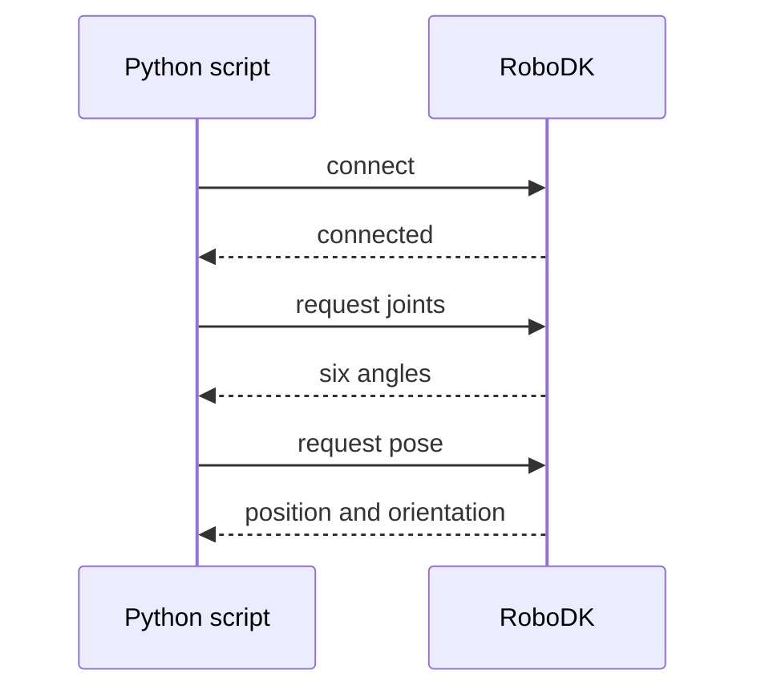
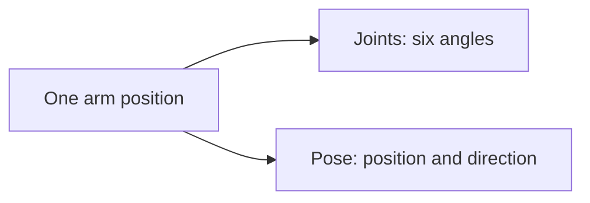

# Meet the Arm

> Tutorial 00 moved the arm by hand. This one does the same thing in code:
> connect to the arm, and read where it is. Nothing moves yet. Before we
> start giving the arm orders, we want to be sure we can hear it answer.

<details>
<summary>Teacher note</summary>

**Mode:** sync, whole class, own RoboDK station each.

**Genuinely new:** `Robolink()` as the connection object; joints and pose
as two different readings of the same state; joint limits and tool frame
as information that exists whether or not anyone asked for it.

**Deliberate error, Step 4:** the import line is written wrong on
purpose, capitalised, matching a mistake we made for real building this
tutorial. The fix is finding the real name with `dir()`, not being told
it.

**Verify before teaching:** `pose_2_xyzrpw` is lowercase on our install,
confirm on yours. `JointLimits()` can return a third value depending on
RoboDK version, the code below indexes rather than unpacks for this
reason. `Tool().Pos()` should return `[0, 0, 0]` with no tool set, not an
error.

</details>

## Before you start

- RoboDK open, with the myCobot 280 loaded (Tutorial 00's station).
- Leave the arm wherever it currently is, we don't need to reset it.
- Run everything from a terminal, or VS Code / VSCodium's built-in
  terminal, not IDLE. IDLE holds onto its output until a script finishes,
  which hides what's happening step by step, and that matters more once
  scripts start moving the arm.

## How this connects



`Robolink()` connects to a RoboDK that's already open, it doesn't launch
one. If RoboDK isn't running, this is the line where your script fails.

## Step 1: Connect

Create a new file called `01_meet_the_arm.py`. Everything in this
tutorial adds to this same file, in order, unless a step says otherwise.

```python
from robodk.robolink import Robolink, ITEM_TYPE_ROBOT

RDK = Robolink()
robot = RDK.Item('', ITEM_TYPE_ROBOT)
if not robot.Valid():
    raise Exception('No robot found. Load the myCobot 280 into the station.')

print('Connected to:', robot.Name())
```

Run it. You should see the robot's own name printed back at you.

## Step 2: Read the joints

The arm has six motors, one per joint. Asking for `Joints()` gets you all
six angles at once, as a list.

```python
joints = robot.Joints().list()
print('Joint angles (degrees):')
number = 1
for angle in joints:
    print('  J' + str(number) + '  ' + str(round(angle, 1)))
    number = number + 1
```

Run it. Six numbers, in degrees, this is the real, physical position of
the arm right now, whatever you left it doing.

Not sure which joint is which? Drag one slider at a time in RoboDK's
robot panel from Tutorial 00, then run this again and watch which number
moves.

> 📷 **Screenshot slot:** RoboDK's robot panel, Joint axis jog section,
> with J3 highlighted or mid-drag. Caption: "J3, the elbow."

## Step 3: Read the pose

```python
pose = robot.Pose()
print(pose)
```

Run it. What you get back is a 4×4 grid of numbers, RoboDK's internal way
of storing a position, and not something you'd want to read by eye.
That's exactly why the next two steps exist.

## Step 4: The broken import, fix it yourself

Add this line right at the top of your file, above everything else:

```python
from robodk.robomath import Pose_2_xyzrpw
```

Run it. You'll get an error:

```
ImportError: cannot import name 'Pose_2_xyzrpw' from 'robodk.robomath'
```

Don't try to guess the correct spelling. Ask the module directly what it
actually contains:

```python
import robodk.robomath as rm
print([name for name in dir(rm) if 'xyzrpw' in name.lower()])
```

Whatever that prints is the real name. Fix your import line to match it,
then delete this two-line check, you don't need it in the finished
script.

This is a genuine mistake we made building this tutorial, not a trick
question. `dir()`, asking Python "what's actually in here", is a tool
worth keeping. You'll want it again the first time some other library
surprises you.

## Step 5: Turn the pose into numbers you can read

```python
x, y, z, rx, ry, rz = pose_2_xyzrpw(pose)
print('X ' + str(round(x, 1)) + '  Y ' + str(round(y, 1)) + '  Z ' + str(round(z, 1)))
print('RX ' + str(round(rx, 1)) + '  RY ' + str(round(ry, 1)) + '  RZ ' + str(round(rz, 1)))
```

Run it. Now compare this to Step 2's joint angles.

## The one idea this tutorial exists to teach

The arm has one physical position right now. Here are the two completely
different ways to describe it:



Both are six numbers. Both describe the exact same arm, at the exact same
moment. Joints tell you how far each motor turned. Pose tells you where
the tool tip is and which way it's pointing. They mean completely
different things, and mixing them up is an easy mistake to make later, so
it's worth being sure of the difference now.

**Try this:** drag a joint slider in RoboDK, then run the whole script
again. Both blocks of output should change. If only one does, something's
wrong, stop and ask rather than pushing on.

## Step 6: Two more things worth knowing

```python
lower = robot.JointLimits()[0].list()
upper = robot.JointLimits()[1].list()
print('Joint limits (degrees):')
number = 1
for low, high in zip(lower, upper):
    print('  J' + str(number) + '  ' + str(round(low, 1)) + ' to ' + str(round(high, 1)))
    number = number + 1

tool_offset = robot.Tool().Pos()
if max(abs(v) for v in tool_offset) < 0.001:
    print('Tool frame: none set.')
else:
    print('Tool frame offset:', tool_offset)
```

**Joint limits** matter because "unreachable" later on usually turns out
to mean a joint has run out of travel, not that the arm is physically too
short to get there.

**Tool frame** will print "none set" right now, and that's an honest
description of this station, not a mistake to fix. It means every
coordinate you've read this tutorial is measured to the arm's mounting
flange, not to wherever a gripper's fingertips would actually be. Keep
that in mind, it's the reason an important move refuses to work later on,
and when it does, you'll already know why.

> 📷 **Screenshot slot:** RoboDK robot panel, Tool Frame section, showing
> all-zero values. Caption: "No tool defined yet, coordinates are to the
> flange."

## What you built

A script that connects to the arm, reads its state two different ways,
and reports two more things worth knowing about it. Nothing moved. Before
asking the arm to go anywhere, we wanted to be sure we could trust what
it told us about where it already was.

**Next:** Tutorial 02, sending the first real command, one joint, one
number changed, everything else held still.
