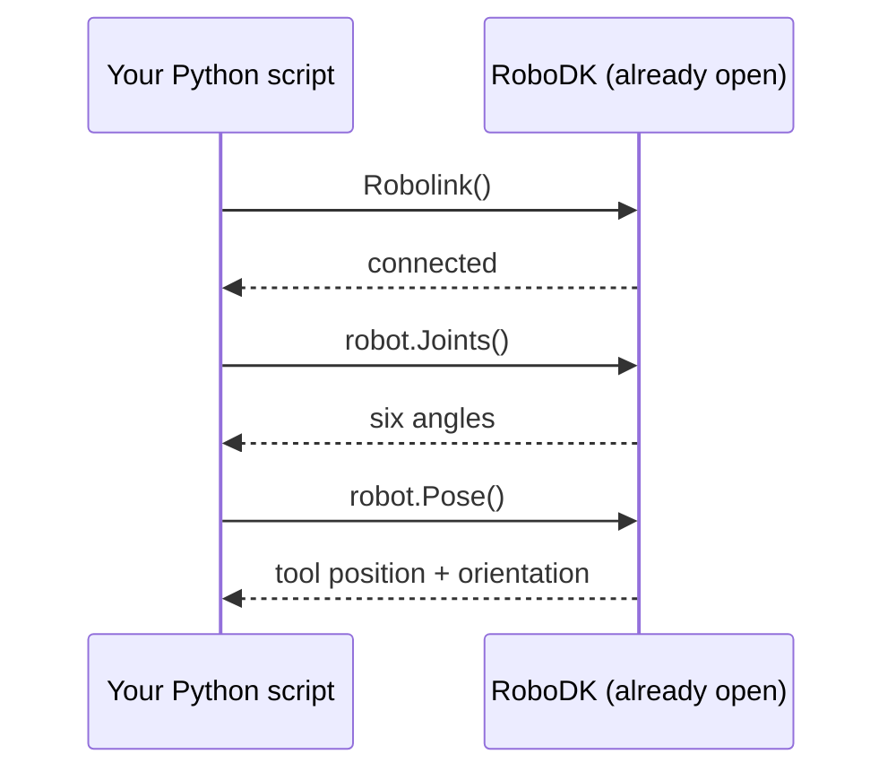
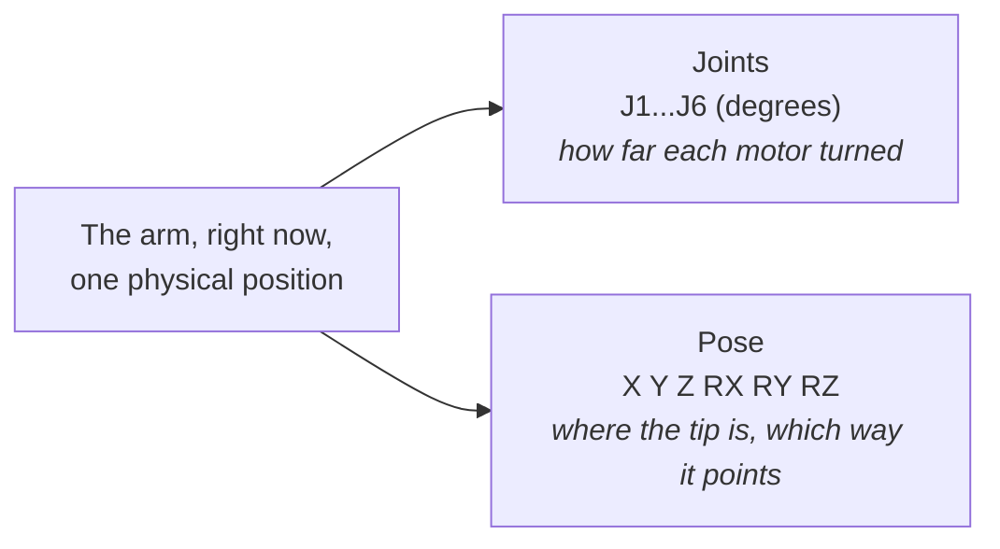

# Meet the Arm: Reading a Robot's State in Python

> Tutorial 00 moved the arm by hand. This tutorial does the same thing in
> code: connect, read where it is, nothing moves. We need to hear the arm
> answer before we start giving it orders.

---

**Teacher note**

- **Mode:** sync, whole class, own RoboDK station each.
- **Genuinely new:** `Robolink()`, joints vs pose as the same state read two
  ways, joint limits and tool frame as state that exists unasked.
- **Deliberate error (Step 4):** import line uses the wrong function name
  on purpose, a mistake we made for real building this. Fix is `dir()`,
  not being told the answer.
- **Verify before teaching:** `pose_2_xyzrpw` lowercase on your install;
  `JointLimits()` return arity (index, don't unpack); `Tool().Pos()`
  returns `[0,0,0]` with no tool set, not an error.

---

## Before you start

- RoboDK open, myCobot 280 loaded (Tutorial 00's station).
- Leave the arm wherever it currently is, don't reset it.
- Run from a terminal or VS/VSCodium, **not IDLE** (it batches output
  until the script ends, which hides what's happening step by step).

## How this connects



`Robolink()` connects to a RoboDK that's already running. It does not
launch one. If RoboDK isn't open, this is where the script fails.

## Step 1: Connect

Create a new file, `01_meet_the_arm.py`. Every block in this tutorial
ADDS to this one file unless it says otherwise.

```python
from robodk.robolink import Robolink, ITEM_TYPE_ROBOT

RDK = Robolink()
robot = RDK.Item('', ITEM_TYPE_ROBOT)
if not robot.Valid():
    raise Exception('No robot found. Load the myCobot 280 into the station.')

print('Connected to:', robot.Name())
```

Run it. Expect the robot's name printed back.

## Step 2: Read the joints

```python
joints = robot.Joints().list()
print('Joint angles (degrees):')
for number, angle in enumerate(joints, start=1):
    print(f'  J{number}  {angle:>8.2f}')
```

- Six numbers, one per axis, degrees.
- Not sure which joint is which physically? Drag one slider at a time in
  RoboDK's robot panel, re-run, see which number moves.

> 📷 **Screenshot slot:** RoboDK's robot panel, Joint axis jog section,
> with J3 highlighted or mid-drag. Caption: "J3, the elbow."

## Step 3: Read the pose

```python
pose = robot.Pose()
print(pose)
```

Run it: you'll get a 4×4 matrix. Not readable by eye. That's the reason
for Step 4 and 5.

## Step 4: The broken import (fix it yourself)

Add to the very top of the file:

```python
from robodk.robomath import Pose_2_xyzrpw
```

Run it. You'll get:

```
ImportError: cannot import name 'Pose_2_xyzrpw' from 'robodk.robomath'
```

**Don't guess the spelling.** Ask the module what it actually contains:

```python
import robodk.robomath as rm
print([name for name in dir(rm) if 'xyzrpw' in name.lower()])
```

Fix your import to match what that prints, then delete the diagnostic
line.

> This is a real bug we hit building this tutorial, not a trick. `dir()`
> as "what's actually in here" is a tool you'll reach for again the first
> time any library surprises you.

## Step 5: Turn the pose into numbers you can read

```python
x, y, z, rx, ry, rz = pose_2_xyzrpw(pose)
print(f'  X {x:.1f}  Y {y:.1f}  Z {z:.1f}   (mm)')
print(f'  RX {rx:.1f}  RY {ry:.1f}  RZ {rz:.1f}   (degrees)')
```

## The one idea this tutorial exists to teach



Two completely different sets of six numbers. Same arm. Same instant.

- **Try this:** drag a slider, re-run the script. Both blocks should
  change. If only one does, stop and flag it, don't push on.

## Step 6: Two more things worth knowing

```python
lower, upper = robot.JointLimits()[0].list(), robot.JointLimits()[1].list()
print('Joint limits (degrees):')
for number, (low, high) in enumerate(zip(lower, upper), start=1):
    print(f'  J{number}  {low:>7.1f} to {high:>7.1f}')

tool_offset = robot.Tool().Pos()
if max(abs(v) for v in tool_offset) < 0.001:
    print("Tool frame: none set.")
else:
    print('Tool frame offset:', tool_offset)
```

- **Joint limits:** "unreachable" later is usually a joint out of travel,
  not the arm being too short.
- **Tool frame:** this will print "none set" right now. Every coordinate
  you've read is measured to the mounting flange, not a gripper's
  fingertips. Remember this, it's the reason a move fails later on.

> 📷 **Screenshot slot:** RoboDK robot panel, Tool Frame section, showing
> all-zero values. Caption: "No tool defined yet, coordinates are to the
> flange."

## What you built

A script that connects, reads six numbers two ways, and reports two more
facts about the arm's state. Nothing moved. Before the arm goes anywhere
by code, we needed to know we could hear it answer honestly.

**Next:** Tutorial 02, one joint, one number changed, everything else
held still.
