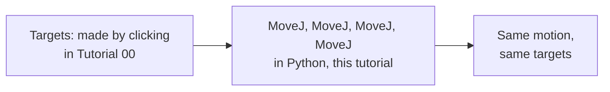

# The Same Program, in Python

> You just built a program by clicking, three targets, one sequence,
> Home to Drop to Rotate and back. This tutorial builds the exact same
> program a second way, in Python, calling the very targets you already
> made. Same result, same targets, different way of asking for it.

<details>
<summary>Teacher note</summary>

**Mode:** sync, whole class.

**Genuinely new:** `RDK.Item('Name')` fetching a GUI-made target by
name; the validity check pattern (`if not thing.Valid():`) as something
worth doing on every lookup, not just the robot itself.

**No deliberate error this tutorial.** The natural failure mode here,
a typo in a target's name, is left as something to notice through the
validity check doing its job, not planted as a trap to trigger on
purpose.

**Verify before teaching:** confirm students genuinely have three
targets named Home, Drop, and Rotate in their station tree from
Tutorial 00 before this lesson starts. If names differ, this tutorial's
code needs matching names, not the other way around.

</details>

## Before you start

RoboDK open, Tutorial 00's station, with Home, Drop, and Rotate still
sitting in the station tree exactly as you left them.

## Step 1: Fetch a target by name

Create a new file called `01_python_program.py`.

```python
from robodk.robolink import Robolink, ITEM_TYPE_ROBOT

RDK = Robolink()
robot = RDK.Item('', ITEM_TYPE_ROBOT)
if not robot.Valid():
    raise Exception('No robot found. Load the myCobot 280 into the station.')

home = RDK.Item('Home')
if not home.Valid():
    raise Exception('Target not found. Check the name matches exactly.')

print('Found target:', home.Name())
```

Run it. You should see the target's name printed back, confirming
Python found the exact thing you clicked together by hand.

`RDK.Item('Home')` looks a target up by the name you gave it in the
station tree, character for character. If you renamed it, or there's a
trailing space, this returns something invalid rather than an error,
which is why the check matters, better to find out immediately than
watch the arm do nothing.

## Step 2: Fetch all three, check all three

Add this next, replacing the single lookup above with three:

```python
home = RDK.Item('Home')
drop = RDK.Item('Drop')
rotate = RDK.Item('Rotate')

for target in (home, drop, rotate):
    if not target.Valid():
        raise Exception('Target not found. Check the name matches exactly.')

print('All three targets found.')
```

Run it. One loop, checking all three the same way, rather than three
separate copies of the same check.

## Step 3: Play the sequence

Add this last block:

```python
robot.MoveJ(home)
robot.MoveJ(drop)
robot.MoveJ(rotate)
robot.MoveJ(home)

print('Sequence complete: Home, Drop, Rotate, Home.')
```

Run it. Watch the 3D view. This should look identical to pressing play
on your clicked program in Tutorial 00, because it's driving the exact
same targets, just from code instead of a click.

## What just changed, and what didn't



The targets themselves didn't change, they're still the same clicked
objects sitting in the station tree. What changed is *how* you told the
arm to visit them, a sequence of clicks versus a sequence of lines. Both
work. The Python version is the one that scales, add a fourth stop and
it's one more line, not a fresh round of clicking and re-recording.

**One thing worth noticing for later:** `RDK.Item('Home')` stays live.
If you go back into RoboDK and drag the Home target somewhere else,
this exact script picks up the change automatically next run, no
edits needed. Generate Robot Program, from Tutorial 00, doesn't do
this, it bakes the coordinates in as fixed numbers the moment you
generate it.

## What you built

The same three-stop program as Tutorial 00, this time driven from
Python, calling the targets you already made rather than retyping their
positions. The bridge from clicking to code, closed.

**Next:** Tutorial 02, reading the arm's own state back, before we start
typing positions instead of relying on targets someone already made.
