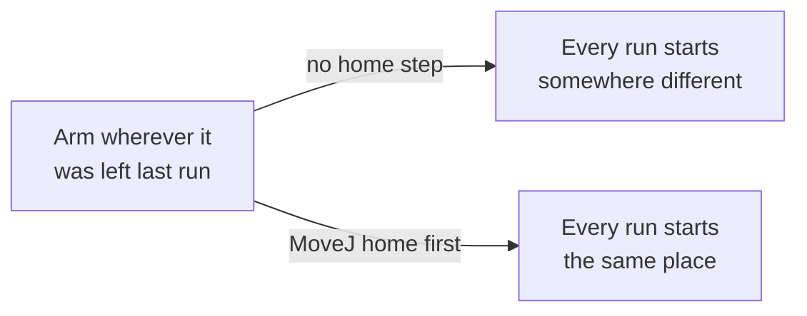

# First Move: Homing and One Joint

> Tutorial 00 dragged a slider. Tutorial 01 read what that did, in code.
> This tutorial sends the first real command: home the arm, then move one
> joint, on purpose, with everything else held still.

---

**Teacher note**

- **Mode:** sync, whole class.
- **Genuinely new:** commanding motion (`MoveJ` with a joint list); homing
  as a repeatability habit, not a formality.
- **No deliberate error this tutorial.** Both fixes were UX ones we made
  live (which joint to move, whether to home first); no code bug to plant.
- **Verify before teaching:** confirm J3 is still the most visually
  dramatic joint to move on the deployed station, this depends on the
  arm's mounting and camera angle in the 3D view, and is worth a five
  second check rather than assumed.

---

## Before you start

RoboDK open, Tutorial 01's station. Doesn't matter where the arm currently
is, homing fixes that.

## Step 1: Why home first



Without a fixed starting point, "the arm moved 30 degrees" means something
different every time you run the script. Home first, always.

## Step 2: Home, then move

Create a new file, `02_first_move.py`. Both blocks in this tutorial go
in this one file, in order.

```python
from robodk.robolink import Robolink, ITEM_TYPE_ROBOT

RDK = Robolink()
robot = RDK.Item('', ITEM_TYPE_ROBOT)
if not robot.Valid():
    raise Exception('No robot found. Load the myCobot 280 into the station.')

home = [0.0, 0.0, 0.0, 0.0, 0.0, 0.0]
print('Homing to all zeros.')
robot.MoveJ(home)

joints_at_home = robot.Joints().list()
print('Joints at home:', [round(a, 1) for a in joints_at_home])
```

Run it. The arm should move to a fixed, flat-out position, whatever it was
doing before.

## Step 3: Move one joint, everything else held still

```python
target = list(home)
target[2] = -90.0    # J3, the elbow

print('Moving J3 to -90 degrees.')
robot.MoveJ(target)

end_joints = robot.Joints().list()
print('End joints:', [round(a, 1) for a in end_joints])
```

- We copied `home`, not typed six numbers from scratch. Changing one
  value and sending the rest unchanged is what proves only J3 moved.
- **Why J3, not J1?** J1 rotates the base in a flat plane, which barely
  reads as motion from most 3D view angles. J3 is the elbow, it visibly
  drops the tool.

Run it. Watch the elbow. Then check the printed joints: only position 3
should have changed.

## What you built

Homing as a habit, and the smallest possible motion command: one joint,
one number, everything else unchanged. Every later tutorial homes first,
without re-explaining why.

**Next:** Tutorial 03, giving the arm a position instead of a joint angle,
and letting it work out the joints itself.
