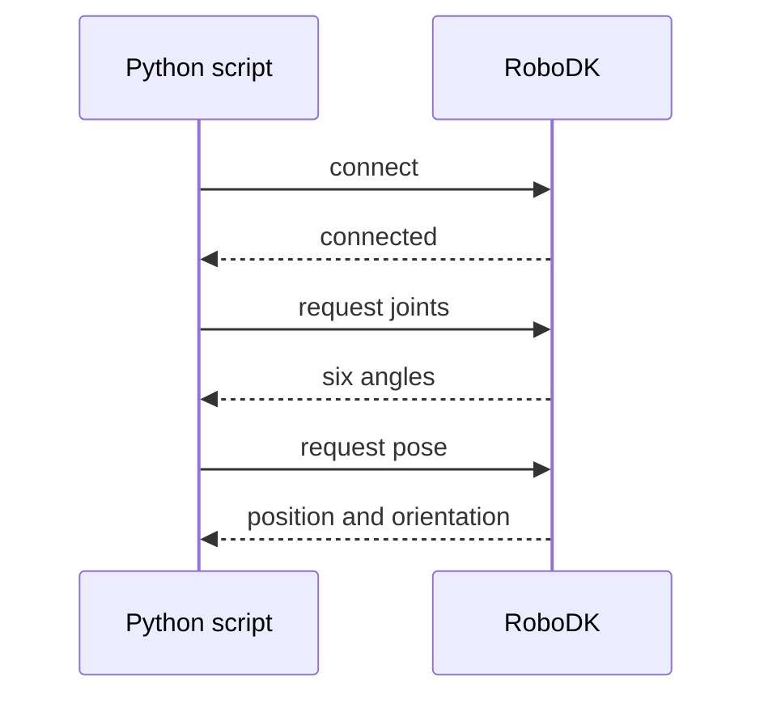
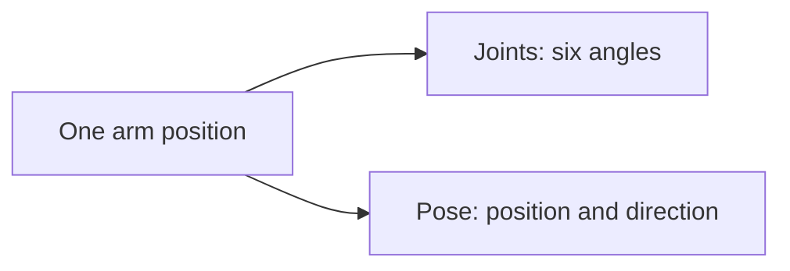

# Meet the Arm

> A robot that puts pieces on exact squares has to be honest about where
> it currently is, every single time, before it trusts itself to move
> anywhere new. This tutorial builds that check: connect to the arm in
> code, and read its state back. Nothing moves yet, this is the arm
> learning to answer for itself, in Python instead of the panel from
> Tutorial 00.

<details>
<summary>Teacher note</summary>

**Mode:** sync, whole class, own RoboDK station each.

**Genuinely new:** `Robolink()` as the connection object; joints and pose
as two different readings of the same state; joint limits and tool frame
as information that exists whether or not anyone asked for it.

**No deliberate error, Step 4.** This step used to have students type a
wrong import on purpose and recover from it. Changed: the risk of typing
something wrong, even briefly, was that it's what a student remembers,
not the lesson. Now it's a proactive check, `dir()` before importing,
not after failing. The naming-convention reasoning (`thing_2_otherthing`)
is still real, transferable content, just reached without a manufactured
mistake first.

**Verify before teaching:** `pose_2_xyzrpw` is lowercase on our install,
confirm on yours. `JointLimits()` can return a third value depending on
RoboDK version, the code below indexes rather than unpacks for this
reason. `Tool().Pos()` should return `[0, 0, 0]` with no tool set, not an
error.

</details>

## Before you start

- RoboDK open, with the myCobot 280 loaded (Tutorial 01's station).
- Leave the arm wherever it currently is, we don't need to reset it.
- IDLE's `F5` works fine for this, it's RoboDK's own embedded Python
  and shows output live as the script runs. The thing to actually avoid
  is running scripts through `pythonw.exe` with no console attached, it
  has nowhere to send `print()` at all, output vanishes silently rather
  than showing up late.

## How this connects



`Robolink()` connects to a RoboDK that's already open, it doesn't launch
one. If RoboDK isn't running, this is the line where your script fails.

## Step 1: Connect

Create a new file called `02_meet_the_arm.py`. Everything in this
tutorial adds to this same file, in order, unless a step says otherwise.

```python
from robodk.robolink import Robolink, ITEM_TYPE_ROBOT

RDK = Robolink()
robot = RDK.Item('', ITEM_TYPE_ROBOT)
if not robot.Valid():
    raise Exception('No robot found. Load the myCobot 280 into the station.')

print('Connected to:', robot.Name())
```

Run it. You should see the robot's own name printed back at you.

## Step 2: Read the joints

The arm has six motors, one per joint. Asking for `Joints()` gets you all
six angles at once, as a list. Add this below what you already have:

```python
joints = robot.Joints().list()
print('Joint angles (degrees):')
number = 1
for angle in joints:
    print(f'  J{number}  {angle:.1f}')
    number = number + 1
```

Run it. Six numbers, in degrees, this is the real, physical position of
the arm right now, whatever you left it doing.

Not sure which joint is which? Drag one slider at a time in RoboDK's
robot panel from Tutorial 00, then run this again and watch which number
moves.

> 📷 **Screenshot slot:** RoboDK's robot panel, Joint axis jog section,
> with J3 highlighted or mid-drag. Caption: "J3, the elbow."

## Step 3: Read the pose

Add this next, below Step 2's code:

```python
pose = robot.Pose()
print(pose)
```

Run it. What you get back is a 4×4 grid of numbers, RoboDK's internal way
of storing a position, and not something you'd want to read by eye.
That's exactly why the next two steps exist.

## Step 4: Check before you import

You need a function that turns a pose into readable numbers, but you
don't know its exact name yet. Rather than guess and see what happens,
ask the module directly what it actually contains:

```python
import robodk.robomath as rm
print([name for name in dir(rm) if 'xyzrpw' in name.lower()])
```

Run it. You'll get two candidates back: `pose_2_xyzrpw` and
`xyzrpw_2_pose`. Both mention `xyzrpw`, so which one?

The names themselves tell you, if you read them as "convert this, into
that." `pose_2_xyzrpw` means pose, converted to xyzrpw values, going in
the direction you want, since you're holding a `pose` and want readable
numbers out. `xyzrpw_2_pose` is the reverse of that, useful somewhere
else, not here. This naming pattern, `thing_2_otherthing`, shows up
across a lot of libraries, worth recognising rather than memorising this
one case.

Now that you know the real name, add the actual import at the top of
your file:

```python
from robodk.robomath import pose_2_xyzrpw
```

Then delete the two `dir()` lines, they did their job, they don't
belong in the finished script. Your file should now have one working
import at the top and nothing else new.

`dir()`, asking Python "what's actually in here" before you commit to a
name, is a habit worth keeping generally, not just here. You'll want it
again the first time you're not sure what a library actually offers.

## Step 5: Turn the pose into numbers you can read

Add this next, at the end of your file:

```python
x, y, z, rx, ry, rz = pose_2_xyzrpw(pose)
print(f'X {x:.1f}  Y {y:.1f}  Z {z:.1f}')
print(f'RX {rx:.1f}  RY {ry:.1f}  RZ {rz:.1f}')
```

Run it. Now compare this to Step 2's joint angles.

## The one idea this tutorial exists to teach

The arm has one physical position right now. Here are the two completely
different ways to describe it:



Both are six numbers. Both describe the exact same arm, at the exact same
moment. Joints tell you how far each motor turned. Pose tells you where
the tool tip is and which way it's pointing. They mean completely
different things, and mixing them up is an easy mistake to make later, so
it's worth being sure of the difference now.

**Try this:** drag a joint slider in RoboDK, then run the whole script
again. Both blocks of output should change. If only one does, something's
wrong, stop and ask rather than pushing on.

## Step 6: Two more things worth knowing

Add this last block to the end of your file:

```python
lower = robot.JointLimits()[0].list()
upper = robot.JointLimits()[1].list()
print('Joint limits (degrees):')
number = 1
for low, high in zip(lower, upper):
    print(f'  J{number}  {low:.1f} to {high:.1f}')
    number = number + 1

tool_offset = robot.Tool().Pos()
if max(abs(v) for v in tool_offset) < 0.001:
    print('Tool frame: none set.')
else:
    print('Tool frame offset:', tool_offset)
```

**Joint limits** matter because "unreachable" later on usually turns out
to mean a joint has run out of travel, not that the arm is physically too
short to get there.

**Tool frame** will print "none set" right now, and that's an honest
description of this station, not a mistake to fix. It means every
coordinate you've read this tutorial is measured to the arm's mounting
flange, not to wherever a gripper's fingertips would actually be. Keep
that in mind, it's the reason an important move refuses to work later on,
and when it does, you'll already know why.

> 📷 **Screenshot slot:** RoboDK robot panel, Tool Frame section, showing
> all-zero values. Caption: "No tool defined yet, coordinates are to the
> flange."

## One thing you can already ask

You don't have a board yet, that's Tutorial 05's job. But you already
have enough to ask a real question a board game robot actually needs
answered: roughly how far is the tool right now from somewhere a square
might eventually sit?

Add this to the end of your file:

```python
possible_square_x = 135.0
possible_square_y = 0.0
distance = ((x - possible_square_x) ** 2 + (y - possible_square_y) ** 2) ** 0.5
print(f'Roughly {distance:.0f} mm from that point.')
```

Run it. Whatever number comes back, that's a real physical distance, not
a demonstration value. Tutorial 05 turns this same kind of question, "how
far from a square," into something you can ask about all nine squares at
once, from a formula instead of one hardcoded guess.

## What you built

A script that connects to the arm, reads its state two different ways,
reports two more things worth knowing, and used that state to answer a
real question about distance to a point on the board. Nothing moved.
Before asking the arm to go anywhere, we wanted to be sure we could trust
what it told us about where it already was, and that the numbers it
gives back are already useful, not just informational.

**Next:** Tutorial 03, sending the first real command, one joint at a
time, then the limit that hits almost immediately, and the fix,
pointing the arm at an actual square for the first time.
