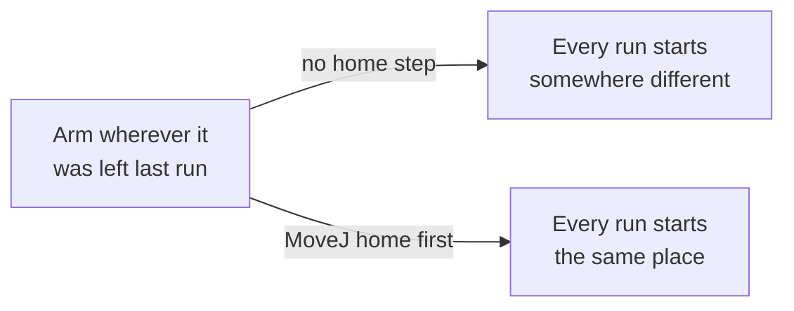
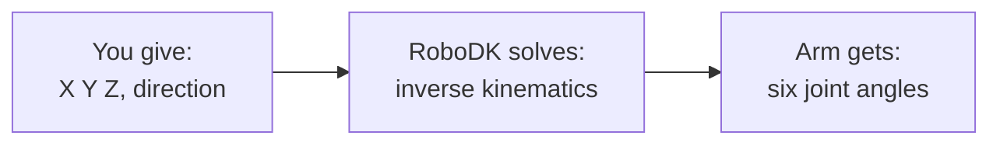

# First Move

> A robot that places pieces has to move on command, reliably, the same
> way every time it's asked, and it has to be told *where*, not just
> *how far each motor turns*. This tutorial covers both: the first real
> command, one joint, on purpose, everything else held still, then the
> limit that command style runs into almost immediately, and the fix,
> describing a position instead. By the end you'll have pointed the arm
> at a real board square for the first time.

<details>
<summary>Teacher note</summary>

**Mode:** sync, whole class. This tutorial now covers what used to be
two, budget accordingly, it's still light content, just more of it in
one sitting.

**Genuinely new, first half:** `MoveJ` already appeared in Tutorial 01,
but always against a named target object, `home = RDK.Item('Home')`,
contents never inspected. Steps 1 to 3 here are the first time `MoveJ`
takes a raw list of six numbers typed directly, and the first time a
student changes one value and watches exactly which joint responds.
Homing as a repeatability habit, not a formality, is the other new idea
in this half.

**Genuinely new, second half:** `MoveJ` given a pose instead of joints;
inverse kinematics treated as a black box we deliberately don't derive,
link lengths and closed-form trig are out of scope, RoboDK solves it,
we use the answer.

**Plant, one sentence only, second half:** `SolveIK` returns the
solution *nearest a reference position*, not "the" answer. Don't
explain further here, it pays off properly in Tutorial 09. Over-
explaining now spoils that.

**This is the milestone tutorial, in its second half specifically.**
Everything before the halfway point is reading state or moving a joint.
The second half is where the arm does something a board game robot
actually needs: point at a real square. Worth naming out loud in class
as its own moment, even mid-tutorial, not letting it pass as just more
of the same lesson.

**No deliberate error in the first half.** Both design choices there,
which joint to move, whether to home first, were UX decisions made
while building this, not code bugs.

**Verify before teaching:** confirm J3 is still the most visually
dramatic joint to move on the deployed station, this depends on mounting
and camera angle. Also run the pose in Step 4 once and confirm it
solves close to the requested numbers on your install. The target,
`(135, 0)`, is square 5's real position once Tutorial 05's board exists,
at `ORIGIN_X = 90`; if your station's mounting differs enough that this
specific point behaves oddly, that's worth knowing before Tutorial 05
builds the rest of the board on the same assumption.

</details>

## Before you start

RoboDK open, Tutorial 02's station. Doesn't matter where the arm
currently is, homing fixes that.

## Part one: moving by joints

## Step 1: Why home first



Without a fixed starting point, "the arm moved 30 degrees" means
something different every time you run the script. Home first, always.

## Step 2: Home, then move

Create a new file called `03_first_move.py`. Every block in this
tutorial adds to this same file, in order.

```python
from robodk.robolink import Robolink, ITEM_TYPE_ROBOT

RDK = Robolink()
robot = RDK.Item('', ITEM_TYPE_ROBOT)
if not robot.Valid():
    raise Exception('No robot found. Load the myCobot 280 into the station.')

home = [0.0, 0.0, 0.0, 0.0, 0.0, 0.0]
print('Homing to all zeros.')
robot.MoveJ(home)

joints_at_home = robot.Joints().list()
print('Joints at home:', joints_at_home)
```

Run it. The arm should move to a fixed, flat-out position, whatever it
was doing before.

## Step 3: Move one joint, everything else held still

Add this next, below what you have:

```python
target = list(home)
target[2] = -90.0    # J3, the elbow

print('Moving J3 to -90 degrees.')
robot.MoveJ(target)

end_joints = robot.Joints().list()
print('End joints:', end_joints)
```

We copied `home` rather than typing six numbers from scratch. Changing
one value and sending the rest unchanged is exactly what proves only J3
moved, nothing else was touched to get this result.

**Why J3, not J1?** J1 rotates the base in a flat plane, which barely
reads as motion from most 3D view angles. J3 is the elbow, it visibly
drops the tool, easy to see the command actually did something.

Run it. Watch the elbow. Then check the printed joints: only position 3
should have changed from the home reading.

## Part two: the limit of joints, and the fix

Joint numbers tell you how far each motor turned. They don't tell you
where the tool actually ended up in space, and they definitely don't
tell you how to get the tool to a *specific place*, square 5 on a board,
say. To do that with joints alone, you'd have to already know the six
correct angles, which you don't, and won't, for nine different squares.
That's the actual limit worth feeling before the fix arrives.

## Step 4: Point at a square that doesn't exist yet

Add this next, below everything you have so far, in the same file:

```python
from robodk.robomath import xyzrpw_2_pose, pose_2_xyzrpw

# X 135, Y 0: this will turn out to be square 5, the centre of the
# board Tutorial 05 builds. You don't know that yet, typed here it's
# just a position.
target_pose = xyzrpw_2_pose([135.0, 0.0, 150.0, 180.0, 0.0, 0.0])
print('Moving to X 135  Y 0  Z 150, tool pointing down.')
robot.MoveJ(target_pose)

end_joints = robot.Joints().list()
achieved = pose_2_xyzrpw(robot.Pose())

print('Joints RoboDK chose:', end_joints)
print('Pose actually reached:', achieved)
```

Run it.

## Step 5: What just happened



You never chose a single joint value this time. RoboDK worked out six
of them at once from one position. Compare "Joints RoboDK chose" to
"Pose actually reached": the pose should closely match what you asked
for, even though you never touched a joint number yourself. That's the
actual fix for the limit Part One ran into.

This is exactly what happened when you typed into the Cartesian Jog
field in Tutorial 00, except now it's a line of code, and we can call it
as many times as we want, which matters a lot once "as many times" means
nine squares instead of one.

**One thing worth knowing and setting aside:** working out those six
joint values from a position is genuinely hard maths for a 6-axis arm,
real robotics engineering, not something to derive by hand at this
level. RoboDK does it for us. We're using the answer, not deriving it.

**One thing worth remembering for later:** RoboDK doesn't just find *an*
answer, it finds the one closest to wherever the arm already was. Keep
that in the back of your mind, it matters more than it sounds like it
should.

## The smallest useful version of this robot

You've just built v1. Small, but real: type a position, the arm points
at it. Every tutorial from here is this same script, upgraded, not a new
one:

- Tutorial 05: point at any of nine squares, from a formula, not one
  hardcoded guess.
- Tutorial 07: touch the board, not just hover over it.
- Tutorial 08: move a piece, not just point.
- Tutorial 09 onward: work reliably everywhere on the board, not just
  the easy squares.

Keep this file. You'll see pieces of it again.

## One thing you can already do

Before positions took over, joint control already gave you one real,
useful thing. Add this to the end of your file:

```python
print('Sending the arm to a resting pose, out of the way.')
resting = list(home)
resting[1] = -30.0
resting[2] = -60.0
robot.MoveJ(resting)
```

Run it. Somewhere safe to sit between moves, clear of the board, not
blocking the camera or a person's view, is a real thing a board game
robot needs, and joint control was enough to build it. Not every
problem needs a position, just the ones that need a specific place.

## What you built

Homing as a habit, the smallest possible motion command, the limit that
command style runs into, and the fix: describing a position and
trusting RoboDK to solve the rest. A genuine first version of the
actual robot, one square, pointed at correctly, plus a resting pose,
built along the way with nothing but joints.

**Next:** Tutorial 04, giving that square, and the board around it, an
actual physical shape you can see, not just a point in empty space.
