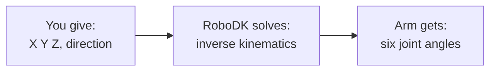

# Positions, Not Angles: Letting the Arm Solve Its Own Joints

> Tutorial 02 chose a joint angle by hand. This tutorial gives the arm a
> position instead, X, Y, Z, and a direction to point, and lets it work
> out the six joint values itself. This is the same trick you did by hand
> in Tutorial 00's Cartesian Jog field, now in code, and it's what makes
> everything from here on possible: we can describe *where*, not *how*.

---

**Teacher note**

- **Mode:** sync, whole class.
- **Genuinely new:** `MoveJ` given a pose instead of joints; inverse
  kinematics as a black box we deliberately don't derive (link lengths and
  closed-form trig are out of scope; RoboDK solves it, we use the answer).
- **Plant, one sentence only:** `SolveIK` returns the solution *nearest a
  reference position*, not "the" answer. Do not explain further here, it
  pays off properly in Tutorial 09. Over-explaining now spoils that.
- **Verify before teaching:** run the pose below once and confirm it
  solves close to the requested numbers on your install; if the arm's
  mounting orientation differs, adjust the target pose.

---

## Before you start

RoboDK open, Tutorial 02's station.

## Step 1: One pose, six numbers, two kinds

Create a new file, `03_positions.py`. This tutorial is one script,
shown in one block.

```python
from robodk.robolink import Robolink, ITEM_TYPE_ROBOT
from robodk.robomath import xyzrpw_2_pose, pose_2_xyzrpw

RDK = Robolink()
robot = RDK.Item('', ITEM_TYPE_ROBOT)
if not robot.Valid():
    raise Exception('No robot found. Load the myCobot 280 into the station.')

home = [0.0, 0.0, 0.0, 0.0, 0.0, 0.0]
robot.MoveJ(home)

target_pose = xyzrpw_2_pose([180.0, 0.0, 150.0, 180.0, 0.0, 0.0])
print('Moving to X 180  Y 0  Z 150, tool pointing down.')
robot.MoveJ(target_pose)

end_joints = robot.Joints().list()
achieved = pose_2_xyzrpw(robot.Pose())

print('Joints RoboDK chose:', [round(a, 1) for a in end_joints])
print('Pose actually reached:', [round(v, 1) for v in achieved])
```

Run it.

## Step 2: What just happened



- You never chose a single joint value. RoboDK worked out six of them at
  once from one position.
- Compare "Joints RoboDK chose" to "Pose actually reached": the pose
  should closely match what you asked for, even though you never touched
  a joint number.
- This is exactly what happened when you typed into the Cartesian Jog
  field in Tutorial 00, except now it's a line of code, and we can call it
  as many times as we want.

**One thing worth knowing and setting aside:** working out those six
joint values from a position is genuinely hard maths for a 6-axis arm,
real robotics engineering, not something to derive by hand at this level.
RoboDK does it for us. We're using the answer, not deriving it.

**One thing worth remembering for later:** RoboDK doesn't just find *an*
answer, it finds the one closest to wherever the arm already was. Keep
that in the back of your mind. It matters more than it sounds like it
should.

## What you built

The handoff from "where" to "how": every tutorial from here describes
positions, never joint angles directly, and trusts RoboDK to solve the
rest.

**Next:** Tutorial 04, turning one position into a whole grid of them,
using nothing but a formula.
