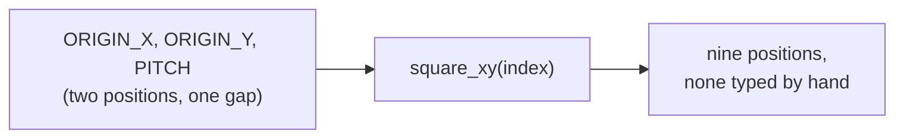

# A Board Made of Numbers

> Upgrading v1: it can now point at any square, not just one. Tutorial
> 03 hardcoded a single position. This tutorial turns that one position
> into a formula, and the formula into all nine squares, the same move,
> just no longer typed by hand for each square.

<details>
<summary>Teacher note</summary>

**Mode:** sync, whole class.

**Genuinely new:** deriving a set of positions from two constants and a
loop, instead of typing each one.

**The plant, ship this exactly:** `ORIGIN_X = 90.0` below is not a safe
choice. It works for every tutorial up to Tutorial 09, then fails there
on purpose. Do not fix it early, and do not let students fix it early
even if they ask why the board sits close to the base. The honest answer
at this point in the arc is genuinely "we'll get to that," not a dodge.

**Verify before teaching:** confirm these exact constants still keep
squares reachable at hover height on your install (they should, this
was checked against real hardware). If your station's mounting differs
enough that squares are unreachable even at hover, the trap needs
different numbers and Tutorial 09's diagnosis needs re-checking too.

</details>

## Before you start

RoboDK open, Tutorial 04's station.

## Step 1: One square, from a formula

Create a new file called `05_board_grid.py`. Every block in this
tutorial adds to this same file, in order.

```python
from robodk.robolink import Robolink, ITEM_TYPE_ROBOT
from robodk.robomath import xyzrpw_2_pose, pose_2_xyzrpw

RDK = Robolink()
robot = RDK.Item('', ITEM_TYPE_ROBOT)
if not robot.Valid():
    raise Exception('No robot found. Load the myCobot 280 into the station.')

home = [0.0, 0.0, 0.0, 0.0, 0.0, 0.0]
robot.MoveJ(home)

# The board's whole geometry lives in these two numbers.
ORIGIN_X = 90.0
ORIGIN_Y = -45.0
PITCH = 45.0
HOVER_Z = 150.0
ORIENTATION = [180.0, 0.0, 0.0]

def square_xy(index):
    """Squares numbered 1-9, near-left to far-right."""
    row = (index - 1) // 3
    col = (index - 1) % 3
    return ORIGIN_X + row * PITCH, ORIGIN_Y + col * PITCH

def square_pose(index, z=HOVER_Z):
    x, y = square_xy(index)
    return xyzrpw_2_pose([x, y, z] + ORIENTATION)

x, y = square_xy(5)
print(f'Square 5 computed at X {x:.1f}  Y {y:.1f}')
robot.MoveJ(square_pose(5))
```

Run it. Square 5 should be the exact same position Tutorial 03 hardcoded
as `(135, 0)`, except this time nothing about it was typed directly, it
fell out of `ORIGIN_X`, `ORIGIN_Y`, and the formula. If those two numbers
don't match, something's off, worth checking before Step 2.

## Step 2: Nine squares, one loop

Add this next, below what you have:

```python
print('Visiting all nine squares.')
for index in range(1, 10):
    robot.MoveJ(square_pose(index))
    print(f'  at square {index}')

robot.MoveJ(home)
```

Run it, watching the 3D view.



**Try this:** change `PITCH` to `30` and re-run. Every square moves.
Nothing else in the script changed.

## The question Tutorial 02 could only ask once

Back in Tutorial 02, you compared the arm's position to one hardcoded
guess at where a square might be. Now you have the real formula, so you
can ask that same question about every square at once.

Add this to the end of your file:

```python
robot.MoveJ(home)
current_x, current_y, current_z, current_rx, current_ry, current_rz = pose_2_xyzrpw(robot.Pose())

print('Distance from home to each square:')
for index in range(1, 10):
    sx, sy = square_xy(index)
    distance = ((current_x - sx) ** 2 + (current_y - sy) ** 2) ** 0.5
    print(f'  square {index}: {distance:.0f} mm')
```

Run it. Nine real distances, from one formula, the exact upgrade
Tutorial 02 promised was coming.

## What you built

A whole board from two numbers and a formula, instead of nine hand-placed
targets, the exact thing Tutorial 00 made you feel the cost of doing by
hand. v1 can now reach anywhere on the board, not just one square.

**One honest note before you move on:** we haven't picked `ORIGIN_X = 90`
for any deep reason, it's a placeholder. Choosing a genuinely good board
position turns out to be a real, non-obvious problem. We're setting it
aside for now and coming back to it properly a few tutorials from here.

**Next:** Tutorial 06, checking whether a position is actually reachable
before sending the arm there.
