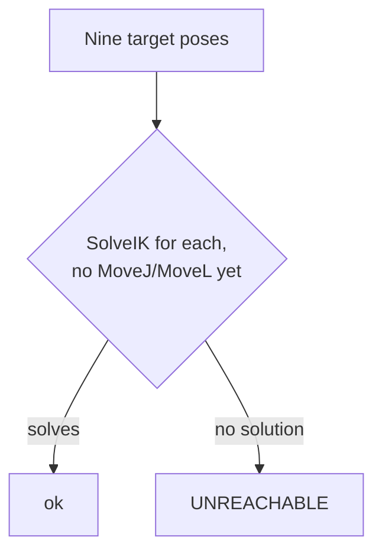
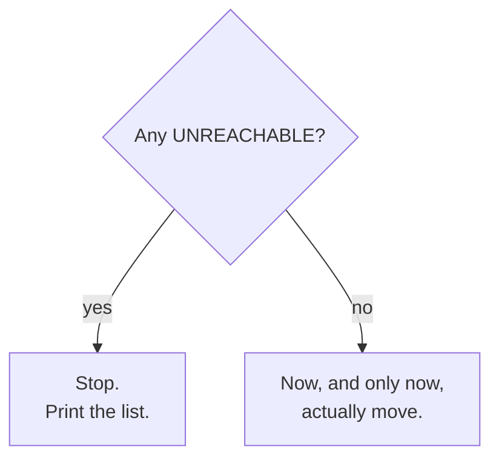

# Check Before You Move

> A typed position can describe a point the arm simply can't reach. A
> taught position can't, you had to physically get the arm there to teach
> it. This tutorial checks reachability before sending any motion, and
> ships with a board position that fails on purpose.

<details>
<summary>Teacher note</summary>

- **Mode:** sync, whole class.
- **Genuinely new:** `SolveIK` used to check without moving; reading a
  pass/fail table before committing to motion.
- **Deliberate error, ship exactly:** `ORIGIN_X = 220.0` below is
  deliberately too large. On our test hardware this produced 6 of 9
  squares reachable, 3 unreachable (squares 7, 8, 9), a genuinely mixed
  result, not everything failing. Students fix the constant back to `90.0`
  (Tutorial 05's value) in Step 5 and re-run to see all nine pass. This is
  a separate, local bug from Tutorial 05's ORIGIN_X trap, don't conflate
  the two in discussion.
- **Verify before teaching:** the specific squares that fail depend on
  arm geometry; confirm the split is genuinely mixed (not 0 or 9) on your
  install before the lesson, and adjust `ORIGIN_X` if needed to get a
  mixed result.

</details>

## Before you start

RoboDK open, Tutorial 05's station.

## Step 1: Recall the board, on purpose broken

Create a new file, `06_check_reach.py`. The board constants and the two
functions below are exactly what you built in Tutorial 05, copy them or
write them from memory. One number is different on purpose, keep
reading before you "fix" it.

```python
from robodk.robolink import Robolink, ITEM_TYPE_ROBOT
from robodk.robomath import xyzrpw_2_pose

RDK = Robolink()
robot = RDK.Item('', ITEM_TYPE_ROBOT)
if not robot.Valid():
    raise Exception('No robot found. Load the myCobot 280 into the station.')

home = [0.0, 0.0, 0.0, 0.0, 0.0, 0.0]
robot.MoveJ(home)

# Deliberately too large. Run everything below once before "fixing" it.
ORIGIN_X = 220.0
ORIGIN_Y = -45.0
PITCH = 45.0
HOVER_Z = 150.0
ORIENTATION = [180.0, 0.0, 0.0]

def square_xy(index):
    row = (index - 1) // 3
    col = (index - 1) % 3
    return ORIGIN_X + row * PITCH, ORIGIN_Y + col * PITCH

def square_pose(index, z=HOVER_Z):
    x, y = square_xy(index)
    return xyzrpw_2_pose([x, y, z] + ORIENTATION)
```

Nothing to run yet, this is just the setup Step 2 needs.

## Step 2: One function, checked on its own first

Add this next, below what you have:

```python
def check_reachable(index):
    """SolveIK without a following MoveJ or MoveL: this checks, it
    doesn't move anything."""
    solution = robot.SolveIK(square_pose(index), home).list()
    return len(solution) >= 6

print('Square 1 reachable:', check_reachable(1))
print('Square 9 reachable:', check_reachable(9))
```

Run it. Square 1 should come back `True`, square 9 should come back
`False`, at this `ORIGIN_X`. Before trusting this function across all
nine squares in a loop, it's worth seeing it get one right answer and
one wrong answer individually, on its own, so you know what it's
actually telling you.

## Step 3: All nine, into a table

Add this next:

```python
print('\nChecking all nine squares before moving anything.\n')
good, bad = [], []
for index in range(1, 10):
    x, y = square_xy(index)
    reachable = check_reachable(index)
    status = 'ok' if reachable else 'UNREACHABLE'
    print(f'  square {index}  X {x:.1f}  Y {y:.1f}   {status}')
    if reachable:
        good.append(index)
    else:
        bad.append(index)
```

Run it. Expect a mixed table, most squares fine, a few flagged
`UNREACHABLE`. Nothing has moved yet, this step only builds two lists,
`good` and `bad`, from the same function you just proved works on its
own.



## Step 4: Decide, only after checking everything

Add this last block:

```python
if bad:
    print(f'\n{len(bad)} of 9 unreachable: {bad}')
    print('Not moving to any of them.')
else:
    print('\nAll nine reachable. Visiting each.')
    for index in good:
        robot.MoveJ(square_pose(index))
```

Run it. With `ORIGIN_X` still at `220.0`, the script stops here and
prints the bad list, nothing moves. That's the actual pattern this
tutorial exists to teach: compute reachability for everything first,
then decide, rather than finding out square by square by watching the
arm fail or lurch toward the wrong place.



## Step 5: Fix it, run the whole thing again

Change `ORIGIN_X` back to `90.0`. Run the whole file again, start to
finish. All nine should now show `ok`, and the arm should actually
visit each square this time.

## What you built

A check that runs *before* motion, built up piece by piece: one
function, proven on two individual squares, then applied across all
nine to build a table, then a decision made from that table, not from
watching the arm fail. `SolveIK` called on its own, with nothing
following it, is the pattern: compute, don't commit.

**Next:** Tutorial 07, going down to the board surface for the first
time, and the first real decision between two ways of moving.
