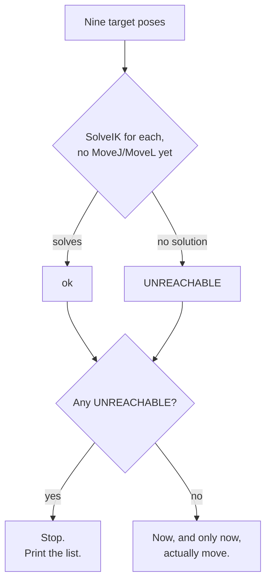

# Check Before You Move

> A typed position can describe a point the arm simply can't reach. A
> taught position can't, you had to physically get the arm there to teach
> it. This tutorial checks reachability before sending any motion, and
> ships with a board position that fails on purpose.

<details>
<summary>Teacher note</summary>

- **Mode:** sync, whole class.
- **Genuinely new:** `SolveIK` used to check without moving; reading a
  pass/fail table before committing to motion.
- **Deliberate error, ship exactly:** `ORIGIN_X = 220.0` below is
  deliberately too large. On our test hardware this produced 6 of 9
  squares reachable, 3 unreachable (squares 7, 8, 9), a genuinely mixed
  result, not everything failing. Students fix the constant back to `90.0`
  (Tutorial 05's value) and re-run to see all nine pass. This is a
  separate, local bug from Tutorial 05's ORIGIN_X trap, don't conflate the
  two in discussion.
- **Verify before teaching:** the specific squares that fail depend on
  arm geometry; confirm the split is genuinely mixed (not 0 or 9) on your
  install before the lesson, and adjust `ORIGIN_X` if needed to get a
  mixed result.

</details>

## Before you start

RoboDK open, Tutorial 05's station.

## Step 1: Ship it broken, run it anyway

Create a new file, `06_check_reach.py`. This tutorial is one script;
Step 2 changes one constant in it, nothing more.

```python
from robodk.robolink import Robolink, ITEM_TYPE_ROBOT
from robodk.robomath import xyzrpw_2_pose

RDK = Robolink()
robot = RDK.Item('', ITEM_TYPE_ROBOT)
if not robot.Valid():
    raise Exception('No robot found. Load the myCobot 280 into the station.')

home = [0.0, 0.0, 0.0, 0.0, 0.0, 0.0]
robot.MoveJ(home)

# Deliberately too large. Run this once before "fixing" it.
ORIGIN_X = 220.0
ORIGIN_Y = -45.0
PITCH = 45.0
HOVER_Z = 150.0
ORIENTATION = [180.0, 0.0, 0.0]

def square_xy(index):
    row = (index - 1) // 3
    col = (index - 1) % 3
    return ORIGIN_X + row * PITCH, ORIGIN_Y + col * PITCH

def square_pose(index, z=HOVER_Z):
    x, y = square_xy(index)
    return xyzrpw_2_pose([x, y, z] + ORIENTATION)

def check_reachable(index):
    """SolveIK without a following MoveJ or MoveL: this checks, it
    doesn't move anything."""
    solution = robot.SolveIK(square_pose(index), home).list()
    return len(solution) >= 6

print('Checking all nine squares before moving anything.\n')
good, bad = [], []
for index in range(1, 10):
    x, y = square_xy(index)
    reachable = check_reachable(index)
    status = 'ok' if reachable else 'UNREACHABLE'
    print(f'  square {index}  X {x:.1f}  Y {y:.1f}   {status}')
    if reachable:
        good.append(index)
    else:
        bad.append(index)

if bad:
    print(f'\n{len(bad)} of 9 unreachable: {bad}')
    print('Not moving to any of them.')
else:
    print('\nAll nine reachable. Visiting each.')
    for index in good:
        robot.MoveJ(square_pose(index))
```

Run it as written first. Expect a mixed table, most squares fine, a few
flagged `UNREACHABLE`, and the script stops without moving.

## Step 2: Fix it, run it again

Change `ORIGIN_X` back to `90.0`. Run again. All nine should now pass, and
the arm should actually visit each square this time.



## What you built

A check that runs *before* motion, from a printed list, not by watching
the arm fail or lurch toward the wrong place. `SolveIK` called on its own,
with nothing following it, is the pattern: compute, don't commit.

**Next:** Tutorial 07, going down to the board surface for the first
time, and the first real decision between two ways of moving.
