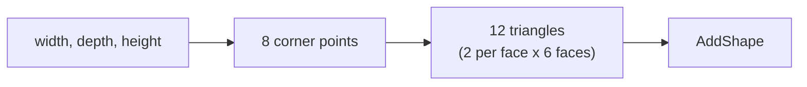

# A Real Board

> Everything so far has moved the arm to invisible points in space. This
> tutorial builds an actual board and actual pieces, solid objects you can
> see in the 3D view, from the same idea as Tutorial 04: numbers and a
> formula, extended from points to solids.

---

**Teacher note**

- **Mode:** sync, whole class.
- **Genuinely new:** `AddShape`, building geometry from a raw list of
  triangle vertices. There is no `AddBox` shortcut in the API, the
  triangle list *is* the work.
- **No deliberate error.** The debugging tool (triangle count must be a
  multiple of 3) is taught as a habit, not triggered by a planted bug.
- **Verify before teaching:** confirm `AddShape` accepts a plain Python
  list of `[x, y, z]` triples on your RoboDK version. Some versions want
  an explicit `robodk.robomath.Mat` first. If a plain list fails, show
  students the error message directly rather than pre-emptively wrapping
  it, matching Tutorial 01's `dir()` habit.

---

## Before you start

RoboDK open, Tutorial 06's station.

## Step 1: A box is twelve triangles

Create a new file, `07_real_board.py`. Steps 1 and 2 define functions;
Step 3 ADDS the code that uses them. All one file, in order.



A box has 6 faces. Each flat face needs 2 triangles (a rectangle split
diagonally). 6 x 2 = 12 triangles, 36 vertices, in groups of 3.

```python
def box_triangles(width, depth, height):
    x, y = width / 2, depth / 2
    bottom = [(-x, -y, 0), (x, -y, 0), (x, y, 0), (-x, y, 0)]
    top = [(-x, -y, height), (x, -y, height), (x, y, height), (-x, y, height)]
    triangles = []

    def quad(a, b, c, d):
        for point in (a, b, c, a, c, d):
            triangles.append(list(point))

    quad(*bottom[::-1])
    quad(*top)
    for i in range(4):
        a, b = bottom[i], bottom[(i + 1) % 4]
        c, d = top[(i + 1) % 4], top[i]
        quad(a, b, c, d)
    return triangles
```

One detail worth knowing: inside `quad`, we use `triangles.append(...)`,
not `triangles += [...]`. They look interchangeable. They aren't, in a
nested function, `+=` counts as reassigning the variable and Python
refuses (`UnboundLocalError`), while `.append` just modifies the existing
list and works fine. If you hit that error later in your own code, this
is what it means.

**Check your work:** `len(box_triangles(160, 160, 6)) % 3` should be `0`,
and the total should be `36`. If it isn't, count faces again before
touching RoboDK.

## Step 2: A cylinder is the same idea, more segments

```python
from math import cos, sin, pi

def cylinder_triangles(radius, height, segments=16):
    angles = [2 * pi * i / segments for i in range(segments)]
    bottom = [(radius * cos(a), radius * sin(a), 0) for a in angles]
    top = [(radius * cos(a), radius * sin(a), height) for a in angles]
    cb, ct = (0, 0, 0), (0, 0, height)
    triangles = []
    for i in range(segments):
        j = (i + 1) % segments
        triangles += [list(bottom[i]), list(bottom[j]), list(top[j])]
        triangles += [list(bottom[i]), list(top[j]), list(top[i])]
        triangles += [list(cb), list(bottom[j]), list(bottom[i])]
        triangles += [list(ct), list(top[i]), list(top[j])]
    return triangles
```

## Step 3: Build the board and pieces

```python
from robodk.robolink import Robolink, ITEM_TYPE_ROBOT
from robodk.robomath import transl

RDK = Robolink()
robot = RDK.Item('', ITEM_TYPE_ROBOT)
if not robot.Valid():
    raise Exception('No robot found. Load the myCobot 280 into the station.')

ORIGIN_X, ORIGIN_Y, PITCH = 90.0, -45.0, 45.0
SURFACE_Z = 100.0
BOARD_THICKNESS = 6.0
BOARD_MARGIN = 20.0

STAGING_X, STAGING_Y, STAGING_PITCH, STAGING_COUNT = 100.0, -120.0, 30.0, 4
PIECE_RADIUS, PIECE_HEIGHT = 12.0, 15.0

def add_solid(triangles, color, name):
    item = RDK.AddShape(triangles)
    if not item.Valid():
        raise Exception(f'AddShape returned no object for {name}.')
    item.setName(name)
    item.Recolor(color)
    return item

board_width = 2 * PITCH + BOARD_MARGIN * 2
board = add_solid(box_triangles(board_width, board_width, BOARD_THICKNESS),
                   [0.75, 0.7, 0.6, 1.0], 'Board plate')
board.setPose(transl(ORIGIN_X + PITCH, ORIGIN_Y + PITCH, SURFACE_Z - BOARD_THICKNESS))

for slot in range(STAGING_COUNT):
    piece = add_solid(cylinder_triangles(PIECE_RADIUS, PIECE_HEIGHT),
                       [0.2, 0.4, 0.9, 1.0], f'Piece {slot}')
    x = STAGING_X + slot * STAGING_PITCH
    piece.setPose(transl(x, STAGING_Y, SURFACE_Z))

print('Board and 4 pieces built. Nothing moved yet.')
```

Run it. You should see a flat plate and four discs appear in the 3D view.

> 📷 **Screenshot slot:** the finished board plate and staged pieces in
> RoboDK's 3D view.

## Make it yours

Choose your own piece radius, board colour, staging arrangement, or board
margin before moving on. These are style choices, not correctness ones.

## What you built

Real, coloured, positioned solids, constructed from the same
numbers-and-formula idea as the board grid in Tutorial 04, just extended
from points to shapes.

**Next:** Tutorial 08, actually picking one of these pieces up.
