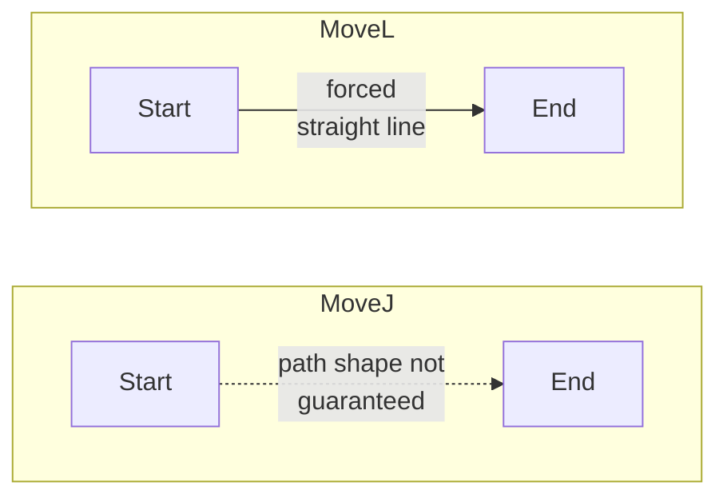

# Down to the Surface

> Every tutorial so far has stayed up at travel height. This one goes
> down to the board and back up, on one square, and it's the first time
> *how* the arm moves between two points actually matters, not just where
> it ends up.

<details>
<summary>Teacher note</summary>

- **Mode:** sync, whole class.
- **Genuinely new:** `MoveL` (straight-line motion) as distinct from
  `MoveJ` (joint-space motion); why the choice matters, not just that two
  functions exist.
- **No deliberate error this tutorial.** The centre square (square 5)
  works cleanly here on our hardware. That's deliberate: this tutorial
  should feel finished. Tutorial 09 is where it stops feeling finished.
- **Verify before teaching:** confirm the centre square's hover-to-surface
  descent is clean (no `TargetReachError`) on your install before this
  lesson. If it already fails here, Tutorial 09's cliffhanger doesn't
  land, students would have seen the failure two tutorials early.

</details>

## Before you start

RoboDK open, Tutorial 06's station, `ORIGIN_X` back to `90.0`.

## Step 1: Two ways to move, and why it's a real choice



- **MoveJ** interpolates joints. Gets you there, but the tool's path
  between the two poses isn't guaranteed to be any particular shape. Fine
  for travelling above a clear board.
- **MoveL** forces the tool to travel in a dead-straight line. Exactly
  what you want for a vertical drop, since a curved path down could clip
  a neighbouring piece. Costs more: it can fail even when both ends are
  individually reachable, if any point along that straight line isn't.

The pattern used from here on: `MoveJ` for travel between squares, `MoveL`
only for the short vertical hover-to-surface segments.

## Step 2: Hover, descend, lift

Create a new file, `07_down_to_surface.py`. One script, one block.

**Before you look at the block below:** you've now typed the
connect-and-home opening four times. Write it from memory first, the two
imports, the connection, the robot lookup with its validity check, and
the home move, then check yourself against the block. If you needed to
peek, that's fine; if you didn't, that's five lines you genuinely own
now.

```python
from robodk.robolink import Robolink, ITEM_TYPE_ROBOT
from robodk.robomath import xyzrpw_2_pose

RDK = Robolink()
robot = RDK.Item('', ITEM_TYPE_ROBOT)
if not robot.Valid():
    raise Exception('No robot found. Load the myCobot 280 into the station.')

home = [0.0, 0.0, 0.0, 0.0, 0.0, 0.0]
robot.MoveJ(home)

ORIGIN_X, ORIGIN_Y, PITCH = 90.0, -45.0, 45.0
HOVER_Z = 150.0
SURFACE_Z = 100.0    # a guess for now, not yet measured or checked
ORIENTATION = [180.0, 0.0, 0.0]

def square_xy(index):
    row = (index - 1) // 3
    col = (index - 1) % 3
    return ORIGIN_X + row * PITCH, ORIGIN_Y + col * PITCH

def square_pose(index, z):
    x, y = square_xy(index)
    return xyzrpw_2_pose([x, y, z] + ORIENTATION)

square = 5   # centre, easiest to watch
print(f'Hovering over square {square}.')
robot.MoveJ(square_pose(square, HOVER_Z))

print('Descending to the surface.')
robot.MoveL(square_pose(square, SURFACE_Z))

print('Lifting back to hover.')
robot.MoveL(square_pose(square, HOVER_Z))

robot.MoveJ(home)
```

Run it. Watch the descent and lift in the 3D view: both should trace the
same straight vertical line.

## What you built

A working vertical drop, on one square, with `MoveJ` and `MoveL` used
deliberately rather than interchangeably.

**One thing worth sitting with:** this worked, on the centre square.
Nothing here has proven it works everywhere on the board.

**Next:** Tutorial 08, the full pick-and-place cycle, using the board
and pieces you already built back in Tutorial 04.
