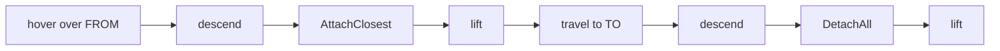

# Pick It Up

> Hover, descend, grip, lift, travel, descend, release, lift. This
> tutorial builds that cycle once, generically, so the same function can
> place a new piece from staging or rearrange one already on the board.

---

**Teacher note**

- **Mode:** sync, whole class.
- **Genuinely new:** `AttachClosest()` / `DetachAll()`, RoboDK's way of
  faking a gripper by proximity, not physics.
- **Deliberate error, real one, ship it:** calling `AttachClosest()` on
  the *robot* item raises `Invalid item provided`. This is not a
  student-facing hint, it's a real error we hit building this arc. The
  fix: attach/detach must be called on a *tool* item, and this station
  doesn't have one yet, `robot.AddTool()` creates a placeholder. This pays
  off Tutorial 01's "tool frame: none set" note, make that connection out
  loud once students have found the fix themselves.
- **Verify before teaching:** confirm the exact error text on your RoboDK
  version; if it differs, the "read the error, don't guess" instruction
  still works but the exact wording in this file needs updating to match.

---

## Before you start

RoboDK open, Tutorial 07's station (board and pieces already built).

## Step 1: Try it the obvious way, watch it fail

Create `08_pick_it_up.py`. Start with just enough to attempt a grab, the
obvious way:

```python
from robodk.robolink import Robolink, ITEM_TYPE_ROBOT
from robodk.robomath import xyzrpw_2_pose, transl

RDK = Robolink()
robot = RDK.Item('', ITEM_TYPE_ROBOT)
if not robot.Valid():
    raise Exception('No robot found. Load the myCobot 280 into the station.')

HOVER_Z, GRIP_Z = 150.0, 109.0
ORIENTATION = [180.0, 0.0, 0.0]
STAGING_X, STAGING_Y = 100.0, -120.0    # slot 0, from Tutorial 07

def pose_at(x, y, z):
    return xyzrpw_2_pose([x, y, z] + ORIENTATION)

robot.MoveJ(pose_at(STAGING_X, STAGING_Y, HOVER_Z))
robot.MoveL(pose_at(STAGING_X, STAGING_Y, GRIP_Z))
attached = robot.AttachClosest()   # <- this line
```

Run it. Expect:

```
Exception: Invalid item provided: The item identifier provided is not
valid or it does not exist.
```

**Don't guess a fix.** Read what actually broke: it's not the position,
attach and detach need a *tool* item, and this station doesn't have one.

## Step 2: Give the robot a tool, then attach through it

```python
def get_or_add_tool(RDK, robot):
    tool = RDK.Item('POC Gripper')
    if not tool.Valid():
        tool = robot.AddTool(transl(0, 0, 0), 'POC Gripper')
    return tool
```

A tool with zero offset from the flange is just a placeholder, enough for
`AttachClosest`/`DetachAll` to have somewhere valid to work from. This is
the same "tool frame: none set" gap Tutorial 01 flagged and set aside.

## Step 3: The generic transfer cycle

```python
from robodk.robolink import Robolink, ITEM_TYPE_ROBOT
from robodk.robomath import xyzrpw_2_pose, transl

RDK = Robolink()
robot = RDK.Item('', ITEM_TYPE_ROBOT)
if not robot.Valid():
    raise Exception('No robot found. Load the myCobot 280 into the station.')

HOVER_Z, GRIP_Z, PLACE_Z = 150.0, 109.0, 100.0
ORIENTATION = [180.0, 0.0, 0.0]

def pose_at(x, y, z):
    return xyzrpw_2_pose([x, y, z] + ORIENTATION)

tool = get_or_add_tool(RDK, robot)

def move_piece(from_x, from_y, to_x, to_y):
    """Works between ANY two positions, staging to board, or board to
    board. Nothing here assumes 'from' is staging."""
    robot.MoveJ(pose_at(from_x, from_y, HOVER_Z))
    robot.MoveL(pose_at(from_x, from_y, GRIP_Z))

    attached = tool.AttachClosest()
    if not attached.Valid():
        robot.MoveL(pose_at(from_x, from_y, HOVER_Z))
        raise Exception('Nothing attached. Check GRIP_Z against the '
                         'piece height, and that something is actually '
                         'there.')
    print('Attached:', attached.Name())

    robot.MoveL(pose_at(from_x, from_y, HOVER_Z))
    robot.MoveJ(pose_at(to_x, to_y, HOVER_Z))
    robot.MoveL(pose_at(to_x, to_y, PLACE_Z))

    tool.DetachAll()
    print('Detached at target.')

    robot.MoveL(pose_at(to_x, to_y, HOVER_Z))
    return attached
```



## Step 4: Run it

Call `move_piece` between a staging position and a board square (using
Tutorial 04's `square_xy` and Tutorial 07's staging positions). Confirm in
the 3D view: the piece should visibly leave staging and land on the
board.

**Why generic, not staging-only?** `move_piece(from, to)` doesn't care
what either end is. That's what lets the same function rearrange a piece
already on the board later, not just place a new one, without writing a
second version.

**GRIP_Z is load-bearing.** `AttachClosest` works by proximity, not by an
actual gripper closing. Too high, and nothing's close enough to grab.

## What you built

One function, `move_piece(from, to)`, that does the entire pick-and-place
cycle between any two positions. Every placement and every rearrangement
from here on calls this, nothing else.

**Next:** Tutorial 09, where one particular call to this function refuses
to work, and why is the whole tutorial.
