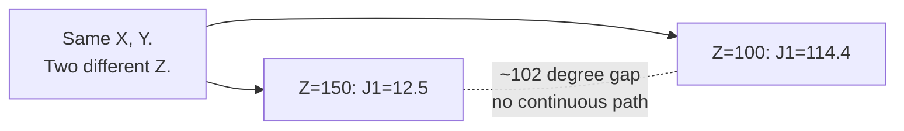

# The Move That Refused

> Everything has worked so far. This tutorial is the one where it stops
> working, on purpose, using the exact board position Tutorial 05 handed
> you and told you not to worry about yet.

<details>
<summary>Teacher note</summary>

- **Mode:** sync, whole class, ideally the full lesson. This is the arc's
  centrepiece, don't rush it.
- **Genuinely new:** the idea that `SolveIK` checking a point in isolation
  is not the same question as whether the arm can *move continuously* to
  it from where it currently is.
- **Deliberate error, real, verified twice on our hardware:** placing a
  piece at board position (0, 0) raises `TargetReachError` on the descent
  to the surface, and the arm visibly curls back over itself approaching
  it. All numbers in Step 3 below are the actual joint solutions from our
  own diagnostic run, not invented for teaching.
- **GUI callback:** the "Other configurations" dropdown from Tutorial 00
  is this exact phenomenon. Point back to it explicitly once students
  reach Step 3.
- **Verify before teaching:** re-run Steps 1 to 3 on the deployed station
  before the lesson. The specific square that fails and the specific
  joint numbers are hardware-dependent; if they differ, use your real
  numbers instead of the ones below, do not fabricate matching ones.

</details>

## Before you start

RoboDK open, Tutorial 08's station, `ORIGIN_X` still at `90.0`.

## Step 1: Place a piece at (0, 0)

Work in your `08_pick_it_up.py` file from last tutorial, this tutorial
starts from exactly where that one ended, then Step 2's check goes in a
separate throwaway file or the console.

Using Tutorial 08's `move_piece`, place a piece from staging onto board
position (0, 0), the near-left square.

Expect:

```
Traceback (most recent call last):
  ...
  File "...\robolink.py", line 6254, in MoveL
    self.link._moveX(target, self, MOVE_TYPE_LINEAR, blocking)
  ...
robodk.robolink.TargetReachError
```

It fails specifically on the `MoveL` call descending to the board, after
the pick already succeeded. Watch the arm right before the error: it
reaches oddly, elbow swung back, not a clean approach.

> 📷 **Screenshot slot:** the arm mid-approach to (0, 0), elbow visibly
> curled, alongside the traceback in the console.

## Step 2: The confusing part

Check both endpoint heights individually with `SolveIK`, no motion:

```python
for z in (100.0, 150.0):   # PLACE_Z, then HOVER_Z
    pose = pose_at(90.0, -45.0, z)
    solution = robot.SolveIK(pose, home).list()
    print(f'Z {z}: reachable={len(solution) >= 6}, joints={[round(v,1) for v in solution]}')
```

Both come back reachable. Individually, this position is fine at both
heights. So why did `MoveL` refuse?

## Step 3: What SolveIK actually returned

Real output from our diagnostic run, this square, these two heights:

| Height | J1 | J2 | J3 | J4 | J5 | J6 |
|---|---|---|---|---|---|---|
| Z 100 (place) | 114.4 | 123.1 | -83.6 | -129.5 | 0.0 | -155.6 |
| Z 150 (hover) | 12.5 | 57.5 | -144.6 | -3.0 | 0.0 | 102.5 |



Same X and Y. Two completely different joint solutions, over 100 degrees
apart on J1 alone. `SolveIK` didn't find "the" answer at each height, it
found the nearest answer *to wherever it was told to start from*, exactly
the thing Tutorial 03 asked you to remember. At Z 150 the nearest sensible
solution happens to be one posture; at Z 100 it's a completely different
one.

**This is what "Other configurations" in Tutorial 00's panel was showing
you.** Same tool position, multiple valid joint solutions. Open that
dropdown now if you haven't, and cycle through it on this exact square.
You'll see the arm snap between postures for one unchanged position.

`MoveL` needs one *continuous* path, every point along the straight line
solvable without jumping branches. Here, there isn't one. `MoveL`
correctly refuses rather than doing something undefined.

## Step 4: A fix, with an honest cost

```python
robot.MoveJ(pose_at(to_x, to_y, PLACE_Z))   # was MoveL
```

Swap the descent (and the following lift) from `MoveL` to `MoveJ`. Run
Step 1 again. It should now succeed.

**What you gave up:** `MoveJ` no longer guarantees a straight vertical
drop. Fine for an empty square. Worth remembering once the board has
neighbouring pieces close enough to clip.

## What you built

A real diagnosis of a real failure: comparing joint *solutions*, not just
checking reachability, to explain why a straight-line move can fail even
when both ends are individually fine.

**One thing left unfixed on purpose:** swapping to `MoveJ` treats the
symptom. The actual cause is that this board position sits close enough
to the base to force the arm into an awkward reach. That's Tutorial 05's
"we'll come back to this", and now you know exactly what "this" is.

**Next:** Tutorial 10, finding a board position where this problem
doesn't happen anywhere on the board, not just patching each square as it
breaks.
