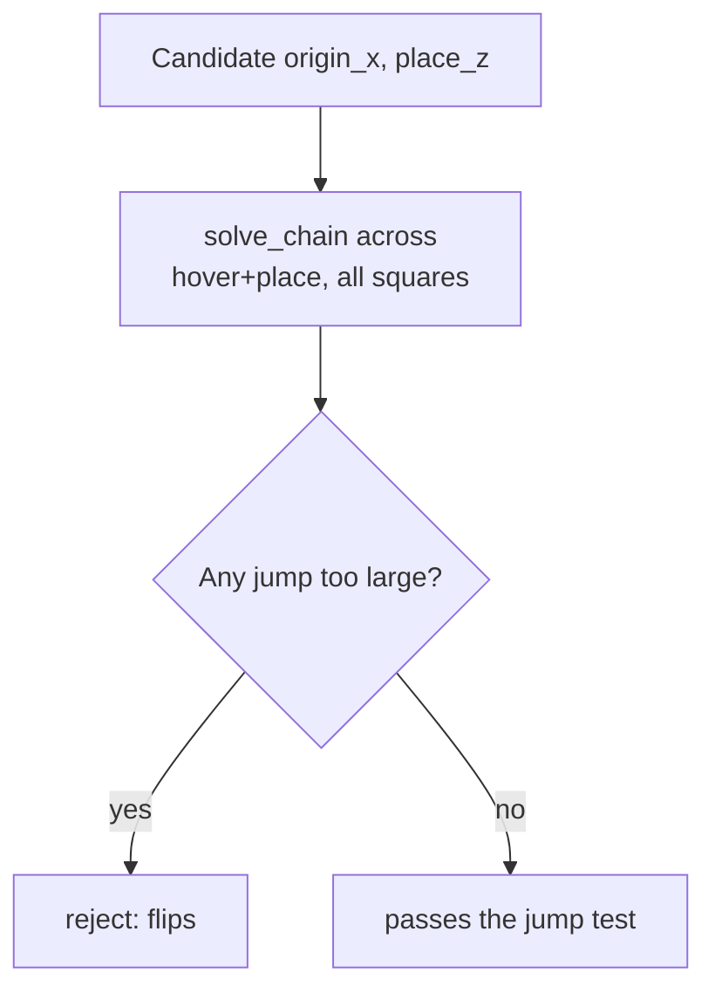

# Where Should the Board Go?

> Tutorial 09 patched one square. This tutorial finds a board position
> where the problem doesn't happen anywhere, by testing candidates
> properly instead of guessing.

<details>
<summary>Teacher note</summary>

- **Mode:** sync, likely its own full lesson. Denser than the rest of the
  arc; that density is deliberate, this is real engineering, not padding.
- **Genuinely new:** solving a *sequence* of poses, each using the
  previous solution as the reference, rather than solving each pose
  independently. This is the one new idea; have students write
  `solve_chain` themselves, everything else can be provided.
- **Second deliberate trap, real, from our own development:** a
  first-pass scoring metric (largest joint jump only) picked a "winner"
  that was flip-free but sat at 94% of the arm's nominal reach, nearly
  fully extended. We built it, ran it, and only noticed by checking the
  actual numbers. Have students hit the same blind spot before showing
  the fix.
- **Verify before teaching:** re-run the sweep on the deployed station;
  results are entirely hardware-dependent. Use your own numbers, not the
  ones below. **Critically: the MoveL-restored placement at the new
  layout was never actually run in our development session**, the sweep
  predicted it works, but Step 5's outcome is genuinely unverified. Run
  it yourself before the lesson; if it fails, that becomes the lesson's
  best material, not a problem.

</details>

## Before you start

RoboDK open, Tutorial 09's station.

## Step 1: Build solve_chain yourself

Create a new file, `10_solve_chain.py`, for Steps 1 and 2. Step 3 runs
the provided `find_best_layout.py` alongside it, unchanged.

The problem with checking each pose from `home`: it answers "is this
point reachable", not "can the arm actually get from one point to the
next", which is the real question after Tutorial 09.

```python
def solve_chain(robot, poses, home):
    """Solve poses IN SEQUENCE, each using the previous solution as the
    reference, the way the arm actually moves. Returns None if any pose
    fails to solve."""
    solutions = []
    reference = home
    for pose in poses:
        result = robot.SolveIK(pose, reference).list()
        if len(result) < 6:
            return None
        joints = list(result[:6])
        solutions.append(joints)
        reference = joints        # <- the whole idea is this line
    return solutions
```

Write this yourself before looking at the version above. The one thing to
get right: each pose's reference must be the *previous solution*, not
`home` every time.

## Step 2: Score a candidate layout

```python
def max_jump(solutions):
    worst = 0.0
    for a, b in zip(solutions, solutions[1:]):
        worst = max(worst, max(abs(x - y) for x, y in zip(a, b)))
    return worst
```

A big jump between consecutive poses means the solver changed branch,
exactly the ~102 degree gap from Tutorial 09.

## Step 3: Run the sweep (provided)

The full sweep script, testing a range of board positions and heights,
is provided separately: `find_best_layout.py`. Run it against your
station.



## Step 4: The trap inside the trap

Here's real output from our own sweep, ranked by jump size alone:

| origin_x | place_z | jump | descent | far corner reach |
|---|---|---|---|---|
| 170 | 60 | 44.7° | 31.5° | **94%** |
| 130 | 140 | 56.1° | 34.9° | 80% |

The first row looks like the winner: lowest jump, no flips. But check the
last column. 94% of nominal reach means the arm is nearly straight at the
far corner, one singularity away from the exact problem this tutorial set
out to fix, and the flip-jump metric alone can't see it.

**Add a second check:**

```python
def reach_fraction(origin_x, pitch, nominal_reach=280.0):
    far = ((origin_x + 2 * pitch) ** 2 + pitch ** 2) ** 0.5
    return far / nominal_reach
```

Reject anything over roughly 85% reach, even if the jump score looks
clean. The 130/140 row above, worse jump score, genuinely better layout,
is what that check surfaces.

**Why this is worth dwelling on:** it's the same lesson as Tutorial 09
one level up. "Passes the test I wrote" and "is actually good" are not
automatically the same thing, and the gap only shows up if you check.

## Step 5: Apply it

Update `ORIGIN_X`, `ORIGIN_Y`, `SURFACE_Z`, and `HOVER_Z` in your board
script to the layout the sweep (with both checks) recommends. Re-run
Tutorial 09's Step 1, the failing placement, with `MoveL` restored instead
of the `MoveJ` patch, and watch two things: whether the placement
succeeds, and whether the arm's approach looks clean rather than curled.

Whatever happens is the result worth having. If it works with a genuine
straight-line descent, the layout fixed the cause, not the symptom. If it
still fails somewhere, that square is telling you something the
five-square coarse pass didn't sample, run `solve_chain` on that specific
square's hover-to-place pair and look at the jump.

## What you built

A board position chosen by evidence, not guesswork, and a second lesson
in why one metric is rarely the whole picture.

**Next:** Tutorial 11, a real interface for driving the cell instead of
editing constants and re-running a script.
