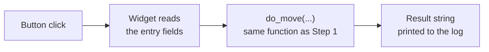

# The Control Panel

> Editing constants and re-running a script works, but it's not how you'd
> actually want to drive this cell. This tutorial builds a small window:
> type a position, click a button, watch it happen.

---

**Teacher note**

- **Mode:** sync, whole class.
- **Genuinely new:** separating *logic* (a function that takes plain
  values in, returns a plain string out) from *interface* (widgets that
  only ever call that function). Nothing about the robot logic changes
  from Tutorial 08, only how it's triggered.
- **Recall, name it out loud:** this is the same split you used between a
  Python function and its Gradio wiring in the AI-Integrated Websites
  semester. Same idea, different toolkit.
- **No deliberate error, but a real gotcha worth mentioning if it comes
  up:** clicking a window that's lost OS focus (common when it's opened
  from another running application) can leave buttons working but typing
  dead. Not core content, a footnote if a student hits it.
- **Verify before teaching:** Tkinter usually ships with Python, but
  *embeddable* Windows distributions (which RoboDK's bundled Python is a
  variant of) often exclude it. On our install it's present (IDLE runs,
  and IDLE requires it), but check yours: `python -c "import tkinter"`
  from RoboDK's own interpreter before the lesson. If it's missing, this
  tutorial needs the system Python or a Gradio rewrite instead.

---

## Before you start

RoboDK open, Tutorial 10's station, board position updated.

## Step 1: Logic first, no window yet

Create a new file, `11_control_panel.py`. It needs `move_piece` and the
board constants: copy them in from your Tutorial 08 and 10 files first,
at the top. Steps 1 and 2 then ADD below them, in order.

```python
def do_move(from_x, from_y, to_x, to_y):
    """Takes plain values in, returns a plain string out. This function
    has no idea a window exists. Test it by calling it directly, from
    the console, before any widget touches it."""
    try:
        piece = move_piece(from_x, from_y, to_x, to_y)   # Tutorial 08
        return f'Placed: {piece.Name()}'
    except Exception as err:
        return f'Failed: {err}'
```

Call `do_move` directly, no GUI, confirm it still works exactly as it did
in Tutorial 08.

## Step 2: A thin window around it

```python
import tkinter as tk
from tkinter import ttk

window = tk.Tk()
window.title('Board Cell Control Panel')

x_var, y_var = tk.StringVar(value='0'), tk.StringVar(value='0')

ttk.Label(window, text='Target X').pack()
ttk.Entry(window, textvariable=x_var).pack()
ttk.Label(window, text='Target Y').pack()
ttk.Entry(window, textvariable=y_var).pack()

log = tk.Text(window, height=8)
log.pack()

def on_click():
    result = do_move(*staging_xy(0), float(x_var.get()), float(y_var.get()))
    log.insert('end', result + '\n')

ttk.Button(window, text='Move', command=on_click).pack()
window.mainloop()
```



Run it. Type coordinates, click, watch the log and the 3D view.

## Step 3: Why the split matters

The widgets never touch `robot`, `tool`, or any RoboDK object directly.
They call `do_move` and print whatever it returns. That means:

- You can test all the robot logic from the console, with no window open.
- If you swapped this for a Gradio interface (your Y9 tool), `do_move`
  wouldn't need to change at all, only the wiring around it would.

## Make it yours

Add a button for rearranging a piece already on the board, calling the
same `move_piece(from, to)` from Tutorial 08 with two board positions
instead of a staging position and a board position. Nothing about the
underlying function needs to change, that's the payoff of building it
generic in Tutorial 08.

## What you built

A working interface, and more importantly, proof that the interface is
genuinely optional: everything it does was already true in Tutorial 08.

**Next:** Tutorial 12, the last one, giving the cell an actual game to
play.
