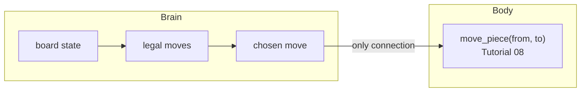

# Your Game

> Everything up to here is the body: an arm that can reach any square and
> place or move a piece there reliably. This tutorial builds a brain, a
> program that knows the rules, and it's separate from the arm on
> purpose. Then it's yours: configure the same cell into a game of your
> choosing.

<details>
<summary>Teacher note</summary>

- **Mode:** sync for the worked example, then open, project-style for the
  ownership build. Budget more than one session for the second half.
- **Genuinely new:** representing game state as plain data (a list); the
  brain/body separation as a deliberate architecture choice, testable
  with zero hardware.
- **Scope, held to deliberately:** the robot's move policy is simple
  rules (win if possible, block if needed, else take the centre or a
  corner), not minimax. Recursion-based game-tree search is a legitimate
  extension for a student who wants it, not core content, it's a
  different skill from everything else in this arc.
- **No deliberate error.** This tutorial is the payoff, not another trap.

</details>

## Before you start

Tutorial 11's control panel working, board position from Tutorial 10.

## Step 1: The board as data, nothing else

Create TWO files this tutorial: `12_brain.py` for Steps 1 and 2 (no
RoboDK imports at all, that's the point), and the wiring in Step 3 goes
at the bottom of your `11_control_panel.py`.

```python
def new_board():
    return [' '] * 9

LINES = [(0,1,2), (3,4,5), (6,7,8), (0,3,6), (1,4,7), (2,5,8), (0,4,8), (2,4,6)]

def winner(board):
    for a, b, c in LINES:
        if board[a] != ' ' and board[a] == board[b] == board[c]:
            return board[a]
    return None
```

No robot, no RoboDK, no import beyond nothing. Test this in a plain Python
console, no station needed.



## Step 2: A policy, not a search

```python
def choose_move(board, mark):
    other = 'O' if mark == 'X' else 'X'

    for player in (mark, other):        # win if you can, else block
        for a, b, c in LINES:
            values = [board[a], board[b], board[c]]
            if values.count(player) == 2 and values.count(' ') == 1:
                return [a, b, c][values.index(' ')]

    if board[4] == ' ':
        return 4
    for corner in (0, 2, 6, 8):
        if board[corner] == ' ':
            return corner
    return next(i for i, v in enumerate(board) if v == ' ')
```

This isn't unbeatable, and that's fine. It's honest, readable rules you
can explain in one sentence each, not a search tree. If you want
unbeatable, minimax is the extension, look it up once this works.

## Step 3: Wire it to the body

Two housekeeping details first, both small but load-bearing:

- The brain numbers squares 0 to 8 (list positions); Tutorial 05's
  `square_xy` numbers them 1 to 9. Converting is `+ 1`, done once,
  visibly.
- The robot needs to know which staging slot still has a piece. A counter
  is enough, the robot places its pieces in slot order.

```python
robot_slot = 0    # next staging slot the robot will take a piece from

def robot_turn(board, mark):
    global robot_slot

    move = choose_move(board, mark)     # 0-8, the brain's numbering
    board[move] = mark

    square = move + 1                   # 1-9, the board's numbering
    from_x, from_y = staging_xy(robot_slot)
    to_x, to_y = square_xy(square)
    do_move(from_x, from_y, to_x, to_y)

    robot_slot = robot_slot + 1
    return move
```

The brain decides `move`. The body executes it. Each line does one thing:
convert the numbering, look up where the piece is, look up where it goes,
move it. Neither half needs to know how the other works.

## Now it's yours

Tic-tac-toe is fully worked above. The cell itself, `move_piece(from,
to)`, the board grid, the geometry, isn't tic-tac-toe-specific. Configure
it into a game of your own:

- Different board dimensions (`ORIGIN`, `PITCH`, board size in Tutorial 05 and 04).
- Different piece shapes or rules.
- A game that needs rearranging pieces, not just placing them, Tutorial 08's `move_piece` already supports it.

Document what you changed, and why the underlying cell didn't need to.

## Where this goes next

This arc trusts its own model of the board completely. It never checks
what's physically there, it assumes the last move it made is still true.
That's the honest limit of an open-loop system.

**What would it take for the robot to *know* the board state instead of
trusting it?** That's the real question behind the Open-Loop Robot-Cell
Design task. This arc built the cell. That task is where you design what
open-loop actually means for it, and what closing the loop would cost.
