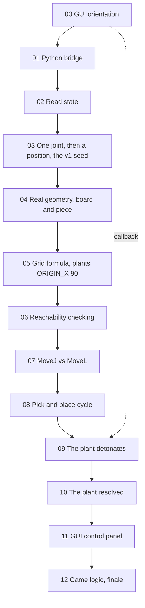

# Teacher's Guide: The Board Game Robot Arc

A working overview, not a lesson plan. Use this to see how the fourteen
tutorials connect before deciding how to slice them into actual
lessons. For per-tutorial teaching notes (mode, verification steps),
see each file's own `
` teacher note. For the build history and
open items, see `PRODUCTION-NOTES.md`.

## The shape of the whole arc

One running app, not fourteen separate exercises. A single position
(Tutorial 03, "point at square 5") becomes the seed, and almost every
tutorial after it is that same seed, upgraded, not a new topic. Two
things carry the whole arc together and are worth knowing before
teaching any single tutorial in isolation:

**A planted flaw.** Tutorial 05 hands students a board position,
`ORIGIN_X = 90`, with an honest note that it's a placeholder and
"we'll come back to this." It works for four tutorials, then genuinely
fails in Tutorial 09, on real hardware, verified, and Tutorial 10 is
where it finally gets fixed properly. Don't let students fix it early
even if they ask why.

**A running callback.** Tutorial 00's GUI panel has an unexplained
"Other configurations" dropdown, deliberately not explained there. It
pays off in Tutorial 09, when that exact phenomenon (one position,
multiple valid joint solutions) is the thing breaking a move. Point
back to it explicitly when you reach that lesson.

## Dependency map

The dotted line is the "Other configurations" dropdown, unexplained in
00, explained in 10. Everything else is a straight chain, each
tutorial's station is the previous one's, nothing skips ahead.

## Per-tutorial breakdown

| # | Title | What it builds | What it needs already in place | Deliberate error |
|---|---|---|---|---|
| 00 | Hands on the Arm | A three-move program (Home, Drop, Rotate) built entirely by clicking, no code | Nothing, this is the starting point | None |
| 01 | The Same Program, in Python | The exact same three-move program, this time written in code | The three named targets from 00, still sitting in the station | None |
| 02 | Meet the Arm | A script that reads back where the arm currently is, two different ways | 01's station | None (removed on purpose, see below) |
| 03 | First Move | Two things in one: the first movement from raw joint numbers, then the limit that hits almost immediately, then the fix, the arm pointing at one real board square. This is the seed everything else grows from | 02's station | None |
| 04 | A Real Board | An actual board and piece you can see in the 3D view, not just an invisible point | 03's station | None in the core path (a genuine surprise, not a bug, see the row below) |
| 05 | A Board Made of Numbers | All nine board squares, from a formula instead of nine hand-typed positions | 04's board and piece objects | None directly, but plants a board position that looks fine and isn't, the arc-long trap |
| 06 | Check Before You Move | A safety check that catches an impossible move before the arm ever tries it | 05's station | Yes: a deliberately bad board position, some squares reachable, some not |
| 07 | Down to the Surface | A clean, reliable descent onto the board, not just hovering above it | 06's station | None |
| 08 | Pick It Up | The actual pick-up-and-place motion, reusable for any two positions on the board | 07's station, plus the board and piece from 04 | Yes: a real error message when the code assumes a gripper that isn't quite set up right |
| 09 | The Move That Refused | A real diagnosis of why one specific square fails, even though it looked fine | 08's station | Yes: a genuine failure on real hardware, the arm visibly struggles to reach one corner |
| 10 | Where Should the Board Go? | A properly chosen board position that works reliably everywhere, not just most places | 09's station | The trap gets resolved here, and a second surprise shows up while fixing it |
| 11 | The Control Panel | A clickable window to drive the robot, no more editing and re-running code by hand | 10's station | None (one minor footnote about clicking away from the window) |
| 12 | Your Game | Working tic-tac-toe logic, then the big one, configuring the whole cell into a game of the student's own choosing | 11's control panel | None, this is the payoff tutorial |

## Completion status, at a glance

**Full house style (frontmatter, collapsible teacher notes, verified
content, app-first framing):** 01 through 05.

**GUI-only, different format on purpose (no code, so no `
`
teacher-note scaffold needed):** 00.

**Correctly renumbered and internally consistent, but still in the
earlier bullet-style draft, not yet given the full house-style pass:**
06 through 12. Content is verified and correct; formatting pass is the
remaining work, tracked in `PRODUCTION-NOTES.md`.

**Genuinely verified against real hardware, not just plausible:** every
deliberate error in the table above, plus Tutorial 04's triangle counts
and Tutorial 10's sweep logic, all independently recomputed during
building, not asserted.

**Still open before this reaches students**, full detail in
`PRODUCTION-NOTES.md`: six screenshot slots need real captures (00 has
6, 02 has 2, 09 has 1); Tutorial 00's generated pymycobot code sample
is a plausible reconstruction, unconfirmed against a real generated
file; Tutorial 10's Step 5 "MoveL now works at the new layout" outcome
was never run end to end in our own session; the f-string question
(avoided throughout, worth one proper teaching step around Tutorial 03,
now that it covers both joints and positions) is undecided; the
arc-wide fast-lookup reference guide doesn't exist yet.

## Pacing signals

Most tutorials are flagged simply "sync, whole class," no special
timing note, meaning roughly comparable weight to each other. A few
are explicitly flagged as different, worth planning around rather than
assuming even pacing throughout:

- **00 is light.** "Well under a full lesson" in its own teacher note.
  Natural pairing with 01, which is also short, if you want one
  lesson to cover both rather than splitting them.
- **03 now covers two things in one sitting.** Was two separate
  tutorials, joint control then positions, merged since both were
  short and the narrative wanted to be continuous. Budget slightly more
  time than a normal single-concept tutorial, even though neither half
  alone is dense.
- **09 wants a full lesson, don't rush it.** It's named as the arc's
  centrepiece in its own teacher note. This is where the planted
  `ORIGIN_X` trap actually detonates and gets diagnosed, compressing
  it costs the whole arc's payoff.
- **10 is denser than the rest, likely its own full lesson too.**
  Building `solve_chain` is real new content, not recall, budget time
  accordingly rather than treating it like a normal-length tutorial.
- **12 has two modes in one tutorial:** sync for the worked
  tic-tac-toe example, then open and project-style for the
  own-game build. Plan for that second half to run longer and looser
  than a typical lesson.

## Pre-lesson checklist, per tutorial

Pulled directly from each file's own "Verify before teaching" note,
collected here so you can scan the whole arc's setup burden at once
rather than opening every file separately.

| # | Check before teaching |
|---|---|
| 01 | Students genuinely have three targets named Home, Drop, Rotate from 00. Wrong names, wrong code. |
| 02 | `pose_2_xyzrpw` is lowercase on your install. `Tool().Pos()` returns `[0,0,0]` with no tool set. |
| 03 | J3 is still the most visually dramatic joint on your station's mounting and camera angle, and the pose solves close to `(135, 0)`, square 5's real future position. |
| 04 | `AddShape` accepts a plain Python list directly on your RoboDK version (confirmed on ours; some versions may want an explicit `Mat`). |
| 05 | These exact constants keep all nine squares reachable at hover height (checked against real hardware, but re-confirm on yours). |
| 06 | The `ORIGIN_X = 220` bug genuinely produces a mixed pass/fail split, not 0 or 9, on your install. |
| 07 | The centre square's descent is clean on your install. If it already fails here, Tutorial 09's cliffhanger doesn't land. |
| 08 | The exact `AttachClosest()` error text matches on your RoboDK version. |
| 09 | Re-run Steps 1 to 3 yourself first. The failing square and joint numbers are hardware-dependent, use your real numbers, never fabricate matching ones. |
| 10 | Re-run the sweep yourself. **The MoveL-restored placement at the new layout was never actually verified end to end in our own build session,** this is the one genuinely open risk in the whole arc. |
| 11 | Confirm Tkinter is actually present in your RoboDK's embedded Python (`python -c "import tkinter"`), embeddable distributions sometimes exclude it. |
| 12 | No specific pre-check flagged; the finale leans on everything before it already working. |

## Two things worth knowing before teaching, not obvious from the table

**Tutorial 02's deliberate error was deliberately removed.** It
originally had students type a wrong import on purpose and recover
from it. Changed to a proactive `dir()` check instead, since the risk
of typing something wrong, even briefly, is that it becomes what a
student remembers rather than the lesson. The transferable content, a
library naming convention, `thing_2_otherthing`, survived the change;
only the manufactured mistake was cut.

**Tutorial 06 and Tutorial 09 test different things, despite both
involving "reachable."** Tutorial 06's check solves each point
independently, referenced from home, answering "is this point
reachable at all." Tutorial 09's square passes that exact check, both
heights individually solve, and still fails, because reachable and
continuously-movable-between are different claims. Worth naming this
distinction explicitly when teaching Tutorial 09, since it's easy to
assume the two tutorials are redundant rather than escalating.
